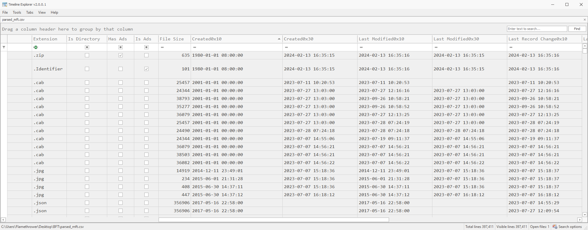
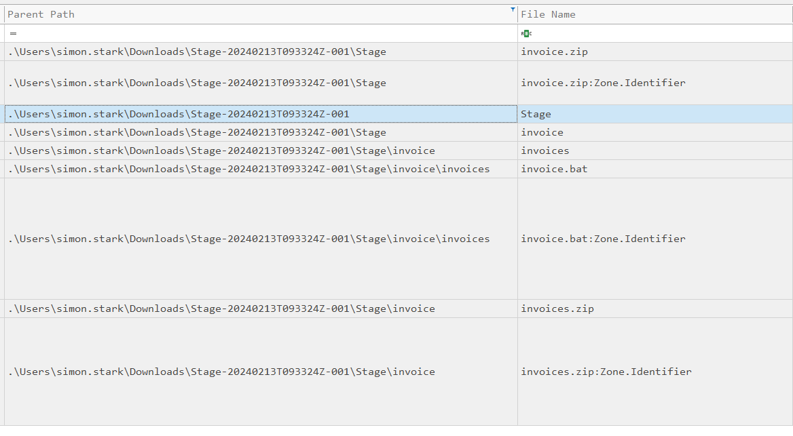
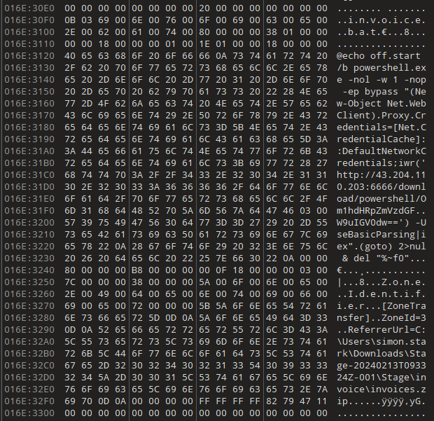

# BFT

## Speech
```
In this Sherlock, you will become acquainted with MFT (Master File Table) forensics. You will be introduced to well-known tools and methodologies for analyzing MFT artifacts to identify malicious activity. During our analysis, you will utilize the MFTECmd tool to parse the provided MFT file, TimeLine Explorer to open and analyze the results from the parsed MFT, and a Hex editor to recover file contents from the MFT.
```

## Analysis
- We need to download the Zimmerman tools : https://ericzimmerman.github.io/#!index.md
- Then we parse the MFT file with MFTECmd : `C:\Users\Flamethrower\Desktop\Tools\zimmerman\net6\MFTECmd.exe -f "C:\Users\Flamethrower\Desktop\BFT\C\$MFT" --csv "C:\Users\Flamethrower\Desktop\BFT" --csvf parsed_mft.csv`
- Then open with Timeline Explorer :

1. Simon Stark was targeted by attackers on February 13. He downloaded a ZIP file from a link received in an email. What was the name of the ZIP file he downloaded from the link?
    - Filtering the column *Created0x10* in order to keep only the 2024-02-13
    - Also filtering the *Extension* column to get only the zip file
    - We have three zip file, KAPE.zip is probably KAPE, KAPE is a program used to recover forensics artifact, probably what the team used to get this MFT file, invoices.zip is in the zip file beginning with *stage* (we see that in the parent path)
    - So the file sent by the attacker is : *theStage-20240213T093324Z-001.zip*
2. Examine the Zone Identifier contents for the initially downloaded ZIP file. This field reveals the HostUrl from where the file was downloaded, serving as a valuable Indicator of Compromise (IOC) in our investigation/analysis. What is the full Host URL from where this ZIP file was downloaded?
    - NTFS use ADS (Alternative Data Streams) which are metadata for files, the .Identifier is a file with the prupose of "tagging" file downloaded from the internet, and NTFS write the URL in this file
    - Get rid of all the filter, beside the file we have an *.Identifier* file which contain the URL : `https://storage.googleapis.com/drive-bulk-export-anonymous/20240213T093324.039Z/4133399871716478688/a40aecd0-1cf3-4f88-b55a-e188d5c1c04f/1/c277a8b4-afa9-4d34-b8ca-e1eb5e5f983c?authuser`
3. What is the full path and name of the malicious file that executed malicious code and connected to a C2 server?
    - This file is probably in the zip file, so let's filter by parent path in order to find what is in the zip file (select all the parent path beginning with : `.\Users\simon.stark\Downloads\Stage...`)
    
    - The most Interesting is the .bat which is a script, that must be the answer (`C:\Users\simon.stark\Downloads\Stage-20240213T093324Z-001\Stage\invoice\invoices\invoice.bat`)
4. Analyze the $Created0x30 timestamp for the previously identified file. When was this file created on disk?
    - Really need to explain anything ?
5. Finding the hex offset of an MFT record is beneficial in many investigative scenarios. Find the hex offset of the stager file from Question 3.
    - We take the entry number which is 23436 and we multiply that by 1024 because each record is 1024 bytes (23998464) and transform to hex : *16E3000*
6. Each MFT record is 1024 bytes in size. If a file on disk has smaller size than 1024 bytes, they can be stored directly on MFT File itself. These are called MFT Resident files. During Windows File system Investigation, its crucial to look for any malicious/suspicious files that may be resident in MFT. This way we can find contents of malicious files/scripts. Find the contents of The malicious stager identified in Question3 and answer with the C2 IP and port.
    - We open the MFT file in a hex editor (I used 010Editor because it's installed on flare)
    
    - Go to the offset previously calculated and we can see the filename then the content then the identifier file