# Subatomic

## Speech
```
Forela is in need of your assistance. They were informed by an employee that their Discord account had been used to send a message with a link to a file they suspect is malware. The message read: "Hi! I've been working on a new game I think you may be interested in it. It combines a number of games we like to play together, check it out!". The Forela user has tried to secure their Discord account, but somehow the messages keep being sent and they need your help to understand this malware and regain control of their account! Warning: This is a warning that this Sherlock includes software that is going to interact with your computer and files. This software has been intentionally included for educational purposes and is NOT intended to be executed or used otherwise. Always handle such files in isolated, controlled, and secure environments. One the Sherlock zip has been unzipped, you will find a DANGER.txt file. Please read this to proceed.
```

## Analysis
It's a malware for Windows and related to Discord, so let's fire up FlareVM to analyse this.
After extracting the zip file, we get a *DANGER.txt* file and another zip, we use the password from *DANGER.txt* to extract *malware.zip* and now we have the malware which is named *nsis-installer.exe*

### Static analysis
1. I open the *nsis-installer.exe* in *PEStudio*.
    - First thing I noticed the manifest which is *Nullsoft.NSIS.exehead* after some research on Nullsoft we learn it's an installer working just like a zip file, it's an exe which extract himself, also mean we can extract him later :)
    - The binary is signed as *Windows Update Assistant* (Obviously a bad signature)
2. Let's take a look at the VirusTotal Scan, this vill give us some answer :D
    - In the details panel of VT we can find the **imphash** and the **SpcSpOpusInfo** (question 1 and 2)
    - We have answered two questions, it's good but what are the **imphash** and the **SpcSpOpusInfo**
    - **imphash** is a hash of the import table, it's use to identify similar malware or family of malware
    - **SpcSpOpusInfo** is a special structure used to identify the project for which the signature was created
3. We want the malware which is in the *nsis-installer.exe*, let's use 7z to extract
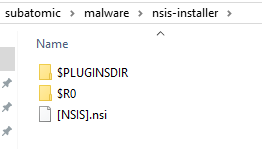
4. We can open *[NSIS].nsi* with notepad in order to see what the extractor will do
    - We see a lot of occurrence of *SerenityTherapyInstaller* this is the file installed by the extractor, also if we go in *$R0* we see the uninstaller for *SerenityTherapyInstaller*
    - We see every thing extracted is located in the *$PLUGINSDIR*
5. In the *$PLUGINSDIR* folder we have some DLL and the file *app-32.7z*, It's our malware ! Let's extract :)
6. We have the installer, and some other file, we have a *LICENSE.electron.txt* which indicate an Electron application (javascript), still not our source code :/ Just the file installing the app
7. We can get the source code, it's in the resources folder, it's the file *app.asar*, asar is like a compiled electron application and we can extract it with *npx*.
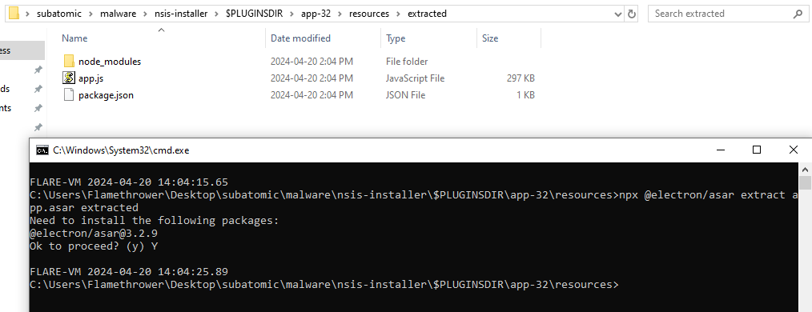
8. Let's examine the **package.json** to get some info on this malware
    - We have the name, also the *main* of the app, the author, etc.
    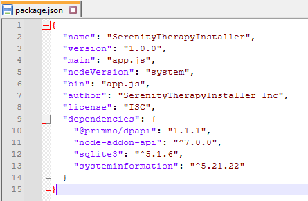

### Dynamic analysis
1. I'll try to debug the app.js, so I open the folder in vs code
2. *App.js* is heavily obfuscated and very long so we must use the debugger to obtain the deobfuscated code, for this I go in *run and debug* (left panel) and I create a launch.json file, to be precise I let VS crete a launch.js file
3. Then I'll press F5 to run
    - 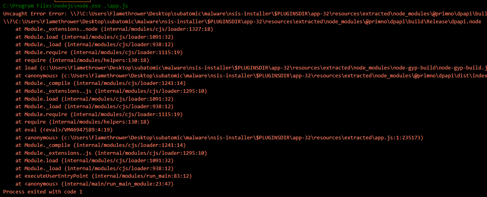
    - To fix this delete the folder *@primno* in *node_modules* and reinstall with : `npm install @primno/dpapi`
    - Relaunch and should crash but because of sqlite3 this time
    - I'll do the same thing for sqlite3
4. Now it should run, we must pause very quickly, let's use F5 to run then F6 to pause, it's tricky to get what we want, I press F5 to launch and immediatly jam F6 to pause, multiple time until I get something interesting
    - Like *anonymous* function called from an eval statement 
    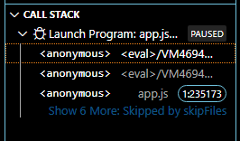

### Go back to static analysis
1. After saving the deobfuscated code in a file (*deob_app.js*) I opened it and begin from the beginning
    - At the top we have some options, an URL which is a probable C2, and a user_id
    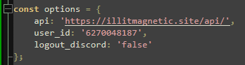
    - Then a function to check if we are in a vm
    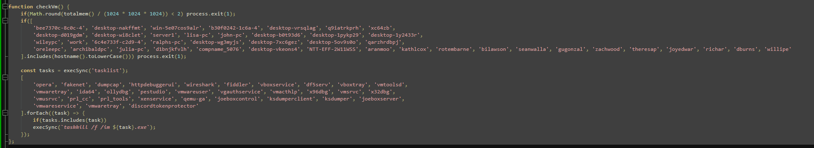
    - We can get an overview of everything the malware do
    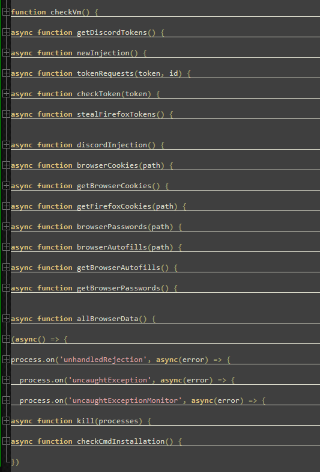
2. We have seen the check for vm (check for hostname and process) we have another check which is interesting it's the checkCmdInstallation :
    - This function check if cmd exist and if not i'll dl cmd-file from the api (in the options constant) then write it to %USERPROFILE%\Documents\cmd.exe
    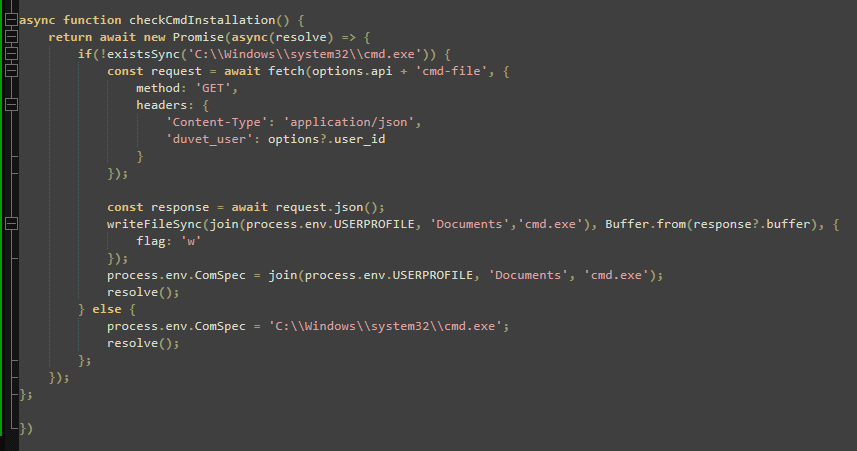
3. now I knwow what the malware is doing and because the names of the others functions are pretty self explanatory i'll go to the question

## Questions
1. What is the Imphash of this malware installer?
    - b34f154ec913d2d2c435cbd644e91687 
    - Cf. Analysis>Static analysis>2
2. The malware contains a digital signature. What is the program name specified in the SpcSpOpusInfo Data Structure?
    - Windows Update Assistant
    - Cf. Analysis>Static analysis>2
3. The malware uses a unique GUID during installation, what is this GUID?
    - cfbc383d-9aa0-5771-9485-7b806e8442d5
    - This one is in the *[NSIS].nsi* file, when we take a closer look at this file a GUID is coming back very often, for example :
    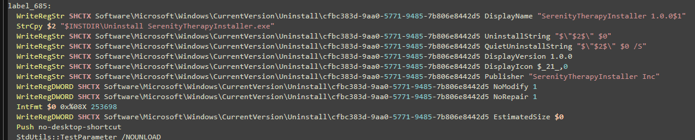
4. The malware contains a package.json file with metadata associated with it. What is the 'License' tied to this malware?
    - ISC
    - Cf. Analysis>Static analysis>9
5. The malware connects back to a C2 address during execution. What is the domain used for C2?
    - illitmagnetic.site
    - Cf. Analysis>Go back to static analysis>1(options screenshot)
6. The malware attempts to get the public IP address of an infected system. What is the full URL used to retrieve this information?
    - https://ipinfo.io/json
    - I just read the function *newInjection* xD
7. The malware is looking for a particular path to connect back on. What is the full URL used for C2 of this malware?
    - https://illitmagnetic.site/api/
    - Cf. Analysis>Go back to static analysis>1(options screenshot)
8. The malware has a configured user_id which is sent to the C2 in the headers or body on every request. What is the key or variable name sent which contains the user_id value?
    - duvet_user
    - If we take a look at where the *user_id* variable is used we get multiple things like this :
    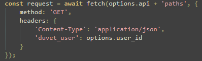
9. The malware checks for a number of hostnames upon execution, and if any are found it will terminate. What hostname is it looking for that begins with arch?
    - archibaldpc
    - Cf. Analysis>Go back to static analysis>1(check vm screenshot)
10. The malware looks for a number of processes when checking if it is running in a VM; however, the malware author has mistakenly made it check for the same process twice. What is the name of this process?
    - vmwaretray
    - Cf. Analysis>Go back to static analysis>1(check vm screenshot)
11. The malware has a special function which checks to see if C:\Windows\system32\cmd.exe exists. If it doesn't it will write a file from the C2 server to an unusual location on disk using the environment variable USERPROFILE. What is the location it will be written to?
    - %USERPROFILE%\Documents\cmd.exe
    - Cf. Analysis>Go back to static analysis>2
12. The malware appears to be targeting browsers as much as Discord. What command is run to locate Firefox cookies on the system?
    - where /r . cookies.sqlite
    - In the function *getFirefoxCookies*
    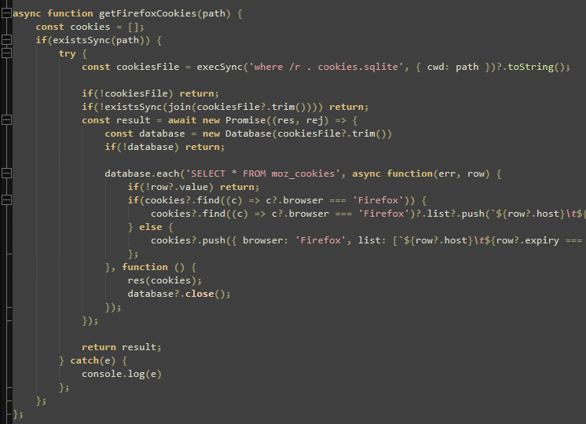
13. To finally eradicate the malware, Forela needs you to find out what Discord module has been modified by the malware so they can clean it up. What is the Discord module infected by this malware, and what's the name of the infected file?
    - discord_desktop_core-1, index.js
    - We can find that in the following function :
    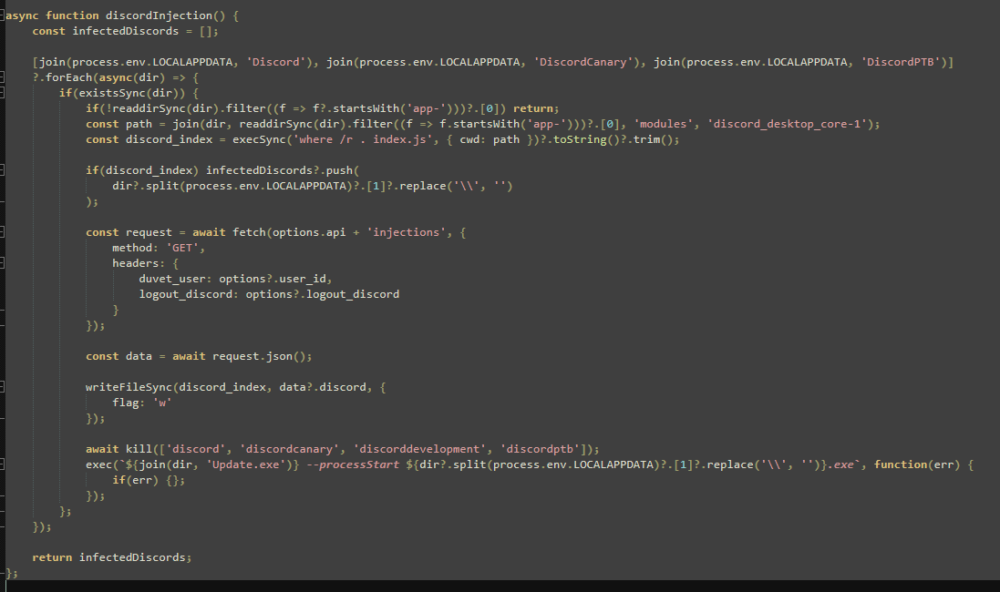
    - We can see the malware begin by passing through the folder *Discord*, *DiscordCanary* and *DiscordPTB*
    - Then he look for the module *discord_desktop_core-1*
    - If he find the module he replace it by an index.js gathered from his API