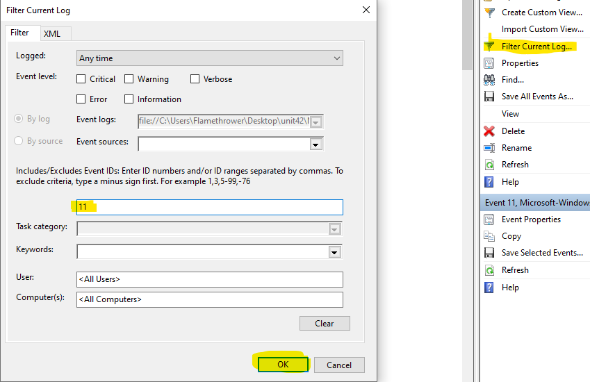
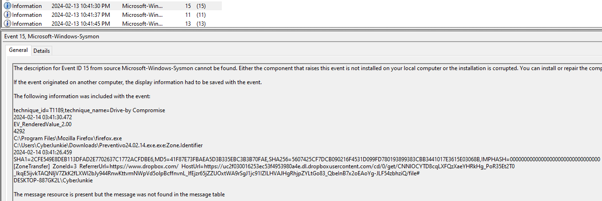

# Unit 42

#windows #evtx #sysmon #palo_alto_unit42 #ultraVNC

## Speech
```
In this Sherlock, you will familiarize yourself with Sysmon logs and various useful EventIDs for identifying and analyzing malicious activities on a Windows system. Palo Alto's Unit42 recently conducted research on an UltraVNC campaign, wherein attackers utilized a backdoored version of UltraVNC to maintain access to systems. This lab is inspired by that campaign and guides participants through the initial access stage of the campaign.
```

## Questions
Let's switch to windows
1. How many Event logs are there with Event ID 11?
    - [Sysmon Event ID 11]](https://www.ultimatewindowssecurity.com/securitylog/encyclopedia/event.aspx?eventid=90011) correspon to FileCreate
    - To easily get the number of EventID 11 I use the "filter current log..." option
    
    - We get 56 logs with event id 11
2. Whenever a process is created in memory, an event with Event ID 1 is recorded with details such as command line, hashes, process path, parent process path, etc. This information is very useful for an analyst because it allows us to see all programs executed on a system, which means we can spot any malicious processes being executed. What is the malicious process that infected the victim's system?
    - Filter on event id 1 (only 6)
    - We see multiple windows executable then : `C:\Users\CyberJunkie\Downloads\Preventivo24.02.14.exe.exe` (after that a file executed by firefox)
3. Which Cloud drive was used to distribute the malware?
    - I sorted the logs from the oldest to the newest, after a little bit of search the most interesting is the Event ID 15 with create the file
    
    - We see the user download it from dropbox
4. The initial malicious file time-stamped (a defense evasion technique, where the file creation date is changed to make it appear old) many files it created on disk. What was the timestamp changed to for a PDF file?
    - Preventivo24.02.14.exe.exe change the timestamp of certain file, first I look for the moment the malicious file is executed, by locating the EventID 1 of the malicious file
    - Look for EventID 2, which is "A process changed a file creation time" and find the pdf file
    - In details find the "previous creation time" : 2024-01-14 08:10:06
5. The malicious file dropped a few files on disk. Where was "once.cmd" created on disk? Please answer with the full path along with the filename.
    - Once.cmd has been timestomp two events before the pdf, in this logs we have the full path : C:\Users\CyberJunkie\AppData\Roaming\Photo and Fax Vn\Photo and vn 1.1.2\install\F97891C\WindowsVolume\Games\once.cmd
    - We can also look at the event ID 11 for FileCreate
6. The malicious file attempted to reach a dummy domain, most likely to check the internet connection status. What domain name did it try to connect to?
    - After scrolling after the timestomp of the pdf file, and ignoring most of the EventID, I stumble on EventID 22 which is : "DNSEvent"
    - We see www.example.com
7. Which IP address did the malicious process try to reach out to?
    - After the DNS we have the EventID 3 : "Network connection detected"
    - With the destination IP : 93.184.216.34
8. The malicious process terminated itself after infecting the PC with a backdoored variant of UltraVNC. When did the process terminate itself?
    - A bit before the previous answer we have an Event ID 5 which is : "Process terminated"
    - If we look at the details we see the image is our malicious file
    - The timestamp of this event is : 2024-02-14 03:41:58