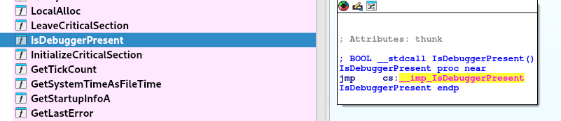
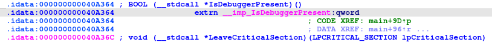
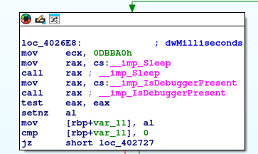

# BOughT

## Speech
```
A non-technical client recently purchased a used computer for personal use from a stranger they encountered online. Since acquiring the computer, the client has been using it without making any changes, specifically not installing or uninstalling any software. However, they have begun experiencing issues related to internet connectivity. This includes receiving error messages such as "Server Not Found" and encountering difficulties with video streaming. Despite these problems, checks with the Windows Network Troubleshooter indicate no issues with the internet connection itself. The client has provided a memory image and disk artifacts for investigation to determine if there are any underlying issues causing these problems.
```

## Analysis

## Questions
1. What is the best volatility profile match for the memory image?
    > Win10x64_19041
    - Use : `python /opt/volatility2/vol.py -f memdump.mem imageinfo`
    - For the rest of the challenge I used vol3 because imageinfo took me 30 minutes...
2. When was the image captured in UTC?
    > 2023-08-07 21:28:13
    - `/opt/volatility3/vol.py -f memdump.mem windows.info.Info`
3. Check running processes and confirm the name of the suspicious running process.
    > SecurityCheck.exe
    - `/opt/volatility3/vol.py -f memdump.mem windows.pstree`
    ```
    PID	PPID	ImageFileName	Offset(V)	Threads	Handles	SessionId	Wow64	CreateTime	ExitTime	Audit	Cmd	Path
    4	0	System	0x960af7868040	134	-	N/A	False	2023-08-07 21:16:18.000000 	N/A	-	-	-
    * 1224	4	MemCompression	0x960afcfe6080	22	-	N/A	False	2023-08-07 21:16:50.000000 	N/A	MemCompression	-	-
    * 92	4	Registry	0x960af79a8040	4	-	N/A	False	2023-08-07 21:16:11.000000 	N/A	Registry	-	-
    * 316	4	smss.exe	0x960afa543040	2	-	N/A	False	2023-08-07 21:16:18.000000 	N/A	\Device\HarddiskVolume2\Windows\System32\smss.exe	\SystemRoot\System32\smss.exe	\SystemRoot\System32\smss.exe
    516	492	csrss.exe	0x960afc0c6140	12	-	1	False	2023-08-07 21:16:47.000000 	N/A	\Device\HarddiskVolume2\Windows\System32\csrss.exe	%SystemRoot%\system32\csrss.exe ObjectDirectory=\Windows SharedSection=1024,20480,768 Windows=On SubSystemType=Windows ServerDll=basesrv,1 ServerDll=winsrv:UserServerDllInitialization,3 ServerDll=sxssrv,4 ProfileControl=Off MaxRequestThreads=16	C:\Windows\system32\csrss.exe
    596	492	winlogon.exe	0x960afc106080	3	-	1	False	2023-08-07 21:16:47.000000 	N/A	\Device\HarddiskVolume2\Windows\System32\winlogon.exe	winlogon.exe	C:\Windows\system32\winlogon.exe
    * 2944	596	userinit.exe	0x960afa59a080	0	-	1	False	2023-08-07 21:18:05.000000 	2023-08-07 21:18:22.000000 	\Device\HarddiskVolume2\Windows\System32\userinit.exe	-	-
    ** 1136	2944	explorer.exe	0x960afa59e080	62	-	1	False	2023-08-07 21:18:07.000000 	N/A	\Device\HarddiskVolume2\Windows\explorer.exe	C:\Windows\Explorer.EXE	C:\Windows\Explorer.EXE
    *** 2376	1136	fmgr.exe	0x960afdd6a080	12	-	1	True	2023-08-07 21:21:38.000000 	N/A	\Device\HarddiskVolume4\Imager\fmgr.exe	"E:\Imager\fmgr.exe" 	E:\Imager\fmgr.exe
    *** 1580	1136	OneDrive.exe	0x960afe2540c0	15	-	1	True	2023-08-07 21:20:21.000000 	N/A	\Device\HarddiskVolume2\Users\User\AppData\Local\Microsoft\OneDrive\OneDrive.exe	"C:\Users\User\AppData\Local\Microsoft\OneDrive\OneDrive.exe" /background	C:\Users\User\AppData\Local\Microsoft\OneDrive\OneDrive.exe
    *** 2572	1136	SecurityCheck.	0x960afe3de0c0	1	-	1	False	2023-08-07 21:20:39.000000 	N/A	\Device\HarddiskVolume2\ProgramData\Microsoft\Windows\Start Menu\Programs\StartUp\SecurityCheck.exe	"C:\ProgramData\Microsoft\Windows\Start Menu\Programs\StartUp\SecurityCheck.exe" 	C:\ProgramData\Microsoft\Windows\Start Menu\Programs\StartUp\SecurityCheck.exe
    **** 4264	2572	conhost.exe	0x960afe354080	3	-	1	False	2023-08-07 21:20:41.000000 	N/A	\Device\HarddiskVolume2\Windows\System32\conhost.exe	\??\C:\Windows\system32\conhost.exe 0x4	C:\Windows\system32\conhost.exe
    *** 3856	1136	msedge.exe	0x960afde94080	0	-	1	False	2023-08-07 21:20:08.000000 	2023-08-07 21:21:14.000000 	\Device\HarddiskVolume2\Program Files (x86)\Microsoft\Edge\Application\msedge.exe	-	-
    *** 344	1136	SecurityHealth	0x960afe2cb0c0	1	-	1	False	2023-08-07 21:20:19.000000 	N/A	\Device\HarddiskVolume2\Windows\System32\SecurityHealthSystray.exe	"C:\Windows\System32\SecurityHealthSystray.exe" 	C:\Windows\System32\SecurityHealthSystray.exe
    * 956	596	dwm.exe	0x960afce7e080	15	-	1	False	2023-08-07 21:16:49.000000 	N/A	\Device\HarddiskVolume2\Windows\System32\dwm.exe	"dwm.exe"	C:\Windows\system32\dwm.exe
    * 748	596	fontdrvhost.ex	0x960afc192140	5	-	1	False	2023-08-07 21:16:48.000000 	N/A	\Device\HarddiskVolume2\Windows\System32\fontdrvhost.exe	"fontdrvhost.exe"	C:\Windows\system32\fontdrvhost.exe
    ```
4. What is the full path of malicious process?
    > C:\ProgramData\Microsoft\Windows\Start Menu\Programs\StartUp\SecurityCheck.exe
    - Cf. Question d'avant
5. What is the sha256 value of the malware?
    > 
    - 
6. What is the compilation timestamp for the malware?
    > 2037-09-03 08:20:55
    - Virustotal put the sha256
7. What is the name of the mutex that the malware creates?
    > config_m2
    - `/opt/volatility3/vol.py -f memdump.mem windows.handles --pid 2572`
    ```
    Volatility 3 Framework 2.7.0
    Progress:  100.00		PDB scanning finished                        
    PID	Process	Offset	HandleValue	Type	GrantedAccess	Name

    2572	SecurityCheck.	0x960afe41b360	0x4	Event	0x1f0003	
    2572	SecurityCheck.	0x960afe41bce0	0x8	Event	0x1f0003	
    2572	SecurityCheck.	0x960afe232c80	0xc	WaitCompletionPacket	0x1	
    2572	SecurityCheck.	0x960afe602a40	0x10	IoCompletion	0x1f0003	
    2572	SecurityCheck.	0x960afe16f060	0x14	TpWorkerFactory	0xf00ff	
    2572	SecurityCheck.	0x960afe55a1c0	0x18	IRTimer	0x100002	
    2572	SecurityCheck.	0x960afe2321f0	0x1c	WaitCompletionPacket	0x1	
    2572	SecurityCheck.	0x960afe55bc50	0x20	IRTimer	0x100002	
    2572	SecurityCheck.	0x960afe2322c0	0x24	WaitCompletionPacket	0x1	
    2572	SecurityCheck.	0x960afe602b10	0x28	EtwRegistration	0x804	
    2572	SecurityCheck.	0x960afe603590	0x2c	EtwRegistration	0x804	
    2572	SecurityCheck.	0x960afe603c90	0x30	EtwRegistration	0x804	
    2572	SecurityCheck.	0xc109d3e4b740	0x34	Directory	0x3	KnownDlls
    2572	SecurityCheck.	0x960afe41b760	0x38	Event	0x1f0003	
    2572	SecurityCheck.	0x960afe41bde0	0x3c	Event	0x1f0003	
    2572	SecurityCheck.	0x960afe462720	0x40	File	0x100020	\Device\HarddiskVolume2\Windows\System32
    2572	SecurityCheck.	0x960afe0d02d0	0x50	ALPC Port	0x1f0001	
    2572	SecurityCheck.	0x960afe468cb0	0x54	File	0x12019f	\Device\ConDrv\Connect
    2572	SecurityCheck.	0x960afe4628b0	0x58	File	0x12019f	\Device\ConDrv\Reference
    2572	SecurityCheck.	0x960afe6128d0	0x5c	EtwRegistration	0x804	
    2572	SecurityCheck.	0x960afe487360	0x60	Mutant	0x1f0001	SM0:2572:304:WilStaging_02
    2572	SecurityCheck.	0xc109d6b59660	0x64	Directory	0xf	BaseNamedObjects
    2572	SecurityCheck.	0x960afe687a50	0x68	Semaphore	0x1f0003	SM0:2572:304:WilStaging_02_p0
    2572	SecurityCheck.	0x960afe68a9d0	0x6c	Semaphore	0x1f0003	SM0:2572:304:WilStaging_02_p0h
    2572	SecurityCheck.	0x960afe612c50	0x70	EtwRegistration	0x804	
    2572	SecurityCheck.	0x960afe6137b0	0x74	EtwRegistration	0x804	
    2572	SecurityCheck.	0x960afe613890	0x78	EtwRegistration	0x804	
    2572	SecurityCheck.	0x960afe3b6d20	0x7c	TpWorkerFactory	0xf00ff	
    2572	SecurityCheck.	0x960afe613340	0x80	IoCompletion	0x1f0003	
    2572	SecurityCheck.	0x960afe55d900	0x84	IRTimer	0x100002	
    2572	SecurityCheck.	0x960afe238850	0x88	WaitCompletionPacket	0x1	
    2572	SecurityCheck.	0x960afa5873e0	0x8c	IRTimer	0x100002	
    2572	SecurityCheck.	0x960afe238b90	0x90	WaitCompletionPacket	0x1	
    2572	SecurityCheck.	0xc109d98c99e0	0x94	Key	0x1	MACHINE\SYSTEM\CONTROLSET001\CONTROL\SESSION MANAGER
    2572	SecurityCheck.	0xc109d98ca590	0x98	Key	0x20019	MACHINE\SYSTEM\CONTROLSET001\CONTROL\NLS\SORTING\VERSIONS
    2572	SecurityCheck.	0x960afe613970	0x9c	EtwRegistration	0x804	
    2572	SecurityCheck.	0x960afe6129b0	0xa0	EtwRegistration	0x804	
    2572	SecurityCheck.	0x960afe611f30	0xa4	EtwRegistration	0x804	
    2572	SecurityCheck.	0xc109d98cc8a0	0xa8	Key	0x9	MACHINE\SOFTWARE\MICROSOFT\WINDOWS NT\CURRENTVERSION\IMAGE FILE EXECUTION OPTIONS
    2572	SecurityCheck.	0x960afaff5420	0xb4	WindowStation	0xf037f	WinSta0
    2572	SecurityCheck.	0x960afaf786a0	0xb8	Desktop	0xf01ff	Default
    2572	SecurityCheck.	0x960afaff5420	0xbc	WindowStation	0xf037f	WinSta0
    2572	SecurityCheck.	0xc109d98cc240	0xc0	Key	0x20019	MACHINE
    2572	SecurityCheck.	0x960afe050960	0xc4	Event	0x1f0003	
    2572	SecurityCheck.	0x960afe239480	0xc8	WaitCompletionPacket	0x1	
    2572	SecurityCheck.	0x960afe6135f0	0xcc	EtwRegistration	0x804	
    2572	SecurityCheck.	0x960afe612a90	0xd0	EtwRegistration	0x804	
    2572	SecurityCheck.	0x960afe611e50	0xd4	EtwRegistration	0x804	
    2572	SecurityCheck.	0x960afe613270	0xd8	EtwRegistration	0x804	
    2572	SecurityCheck.	0x960afe612ef0	0xdc	EtwRegistration	0x804	
    2572	SecurityCheck.	0x960afe613190	0xe0	EtwRegistration	0x804	
    2572	SecurityCheck.	0x960afe4877e0	0xe4	Mutant	0x1f0001	config_m2
    ```
8. At the top of main function which anti-debugging function is being used?
    > IsDebuggerPresent
    - Open in IDA look at all the function and see : IsDebuggerPresent
9. How many minutes does the malware sleep before calling above anti- debugging function?
    > 15
    - Because I know the debug function used I begin by going to the function IsDebuggerPresent
    
    - Then I double clicked on the function name
    
    - I see this function is called in only one function which must be the main
    - By clicking on the XREF we get this
    
    - before the isDebuggerPresent we can see the sleep and before the sleep we can see the `0DBBA0`
10. This malware uses DGA, how many unique C2 domains in total is this DGA capable of generating?
    > 
    - 
11. How many unique C2 domains start with “rb”?
    > 
    - 
12. How many unique C2 domains end with “rla”?
    > 
    - 
13. Which file is being used to store active C2 domain?
    > C:\Users\Public\Documents\win.ini
    - By looking at the main we can see him opening files in order to read them and generate things that will be written to another file
14. Which file is being used to store commands from the C2 server?
    > 
    - 
15. What was the active C2 FQDN at the time of artifact collection?
    > 
    - 
16. How many kinds of DDoS attacks can this malware perform?
    > 
    - 
17. What is the FQDN of the target website.
    > 
    - 
18. What was the expiration date for the active attack at the time of artifact collection in UTC?
    > 
    - 
19. How many GET requests does the malware perform against target domain before sleeping for a while?
    > 
    - 
20. There seems to be another attack method with ICMP requests. How many of these requests can the malware send before sleeping for a while?
    > 
    - 
21. Is this malware prone to Botnet hijacking?
    > 
    - 