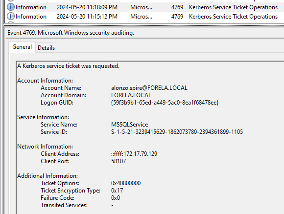
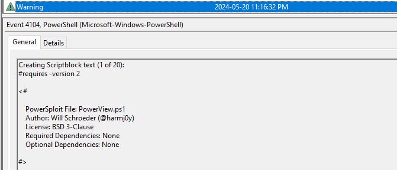
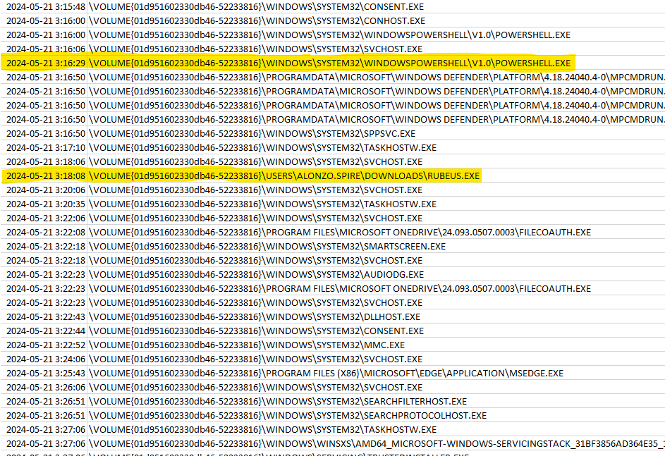

# Campfire-1

## Speech
```
Alonzo Spotted Weird files on his computer and informed the newly assembled SOC Team. Assessing the situation it is believed a Kerberoasting attack may have occurred in the network. It is your job to confirm the findings by analyzing the provided evidence. You are provided with: 1- Security Logs from the Domain Controller 2- PowerShell-Operational Logs from the affected workstation 3- Prefetch Files from the affected workstation
```

## Analysis

- First let's take a look at the kerberoasting techinque

### Kerberoasting
In a Kerberoasting attack the following steps occur :
1. From a domain user the attacker ask the TGS for a service ticket
2. The ticket is encrypted with the password of the service user, so we can crack this hash offline
3. With the plaintext service account password the attacker can request connection on multiple endpoint, now the attacker is not just a domain user he is a service
4. Ressources :
    - [Crowd Strike](https://www.crowdstrike.com/cybersecurity-101/kerberoasting/)
    - [Sentinel One](https://www.sentinelone.com/cybersecurity-101/what-is-kerberoasting-attack/)
    - [Hack Tricks](https://book.hacktricks.xyz/windows-hardening/active-directory-methodology/kerberoast)

- Now we can take a look at the artifacts we have, we start with the DC logs to know when that happened and from where

### DC Logs
1. First let's try to get the moment the attacker ask for a service ticket:
    - after a quick search on Google We get that : `4769(S, F) A Kerberos service ticket was requested.` 
    - Let's filter to keep only `EventID 4769`
    - We find:
    
    - The attacker used powerview to get the list of the domain user

- After finding when and by who the kerberoasting was done we can take a look at the Workstation in order to find more information about what the attacker did on this workstation

### Workstation
1. In the powershell logs:
    - I begin with the oldest log and go up
    - We can see the use of a common script:
    
2. Now the prefetch file:
    - Launch this command to process all the prefetch: `..\Tools\zimmerman\net6\PECmd.exe -d .\Workstation\2024-05-21T033012_triage_asset\C\Windows\prefetch\ --csv ./ --csvf result.csv`
    - Open the timeline and move to the timestamp of the powerview execution:
    
    - The powerview was executed at 3:16:32 and we can see the execution of a powershell at 3:16:29
    - If we look at what is executed after this powershell we notice the RUBEUS execution, a tool for kerberoasting


## Questions
1. Analyzing Domain Controller Security Logs, can you confirm the date & time when the kerberoasting activity occurred?
    > 2024-05-21 03:18:09
    - Cf. Analysis > DC Logs > 1
2. What is the Service Name that was targeted?
    > MSSQLService
    - Cf. Analysis > DC Logs > 1
3. It is really important to identify the Workstation from which this activity occurred. What is the IP Address of the workstation?
    > 172.17.79.129
    - Cf. Analysis > DC Logs > 1
4. Now that we have identified the workstation, a triage including PowerShell logs and Prefetch files are provided to you for some deeper insights so we can understand how this activity occurred on the endpoint. What is the name of the file used to Enumerate Active directory objects and possibly find Kerberoastable accounts in the network?
    > powerview.ps1
    - Cf. Analysis > Workstation > 1
5. When was this script executed?
    > 2024-05-21 03:16:32
    - Cf. Analysis > Workstation > 1
6. What is the full path of the tool used to perform the actual kerberoasting attack?
    > C:\Users\Alonzo.spire\Downloads\Rubeus.exe
    - Cf. Analysis > Workstation > 2
7. When was the tool executed to dump credentials?
    > 2024-05-21 03:18:08
    - Cf. Analysis > Workstation > 2