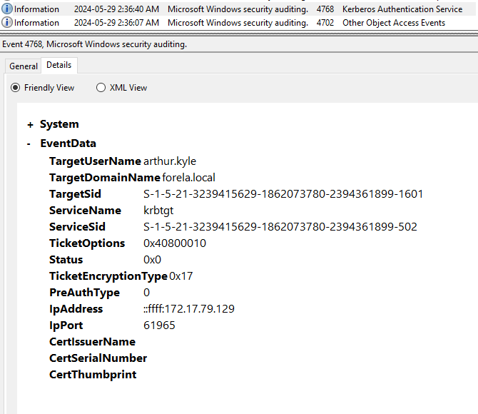

# Campfire-2

## Speech
```
Forela's Network is constantly under attack. The security system raised an alert about an old admin account requesting a ticket from KDC on a domain controller. Inventory shows that this user account is not used as of now so you are tasked to take a look at this. This may be an AsREP roasting attack as anyone can request any user's ticket which has preauthentication disabled.
```

## Analysis
1. We must study an `AsREP roasting attack`, so What is it?
    - [netwrix](https://blog.netwrix.com/2022/11/03/cracking_ad_password_with_as_rep_roasting/)
    - [HackTricks](https://book.hacktricks.xyz/windows-hardening/active-directory-methodology/asreproast)
    - The attacker send an authentication request to the DC in order to receive an AS-REP packet which is partly encrypted with the user's hash
    - Then the attacker can crack this hash
2. We have the `security.evtx` file of the DC
3. We know the attacker need to make Kerberos requests in order to get the hashes, so let's begin by looking at the kerberos requests
    - we ca, look at the `EventId 4768`, the only weird one is this
    
    - The machine `172.17.79.129` made a request to get the hash of the user `arthur.kyle`

## Questions
1. When did the ASREP Roasting attack occur, and when did the attacker request the Kerberos ticket for the vulnerable user?
    > 2024-05-29 06:36:40
    - Cf. Analysis > 3
2. Please confirm the User Account that was targeted by the attacker.
    > arthur.kyle
    - Cf. Analysis > 3
3. What was the SID of the account?
    > S-1-5-21-3239415629-1862073780-2394361899-1601
    - Cf. Analysis > 3
4. It is crucial to identify the compromised user account and the workstation responsible for this attack. Please list the internal IP address of the compromised asset to assist our threat-hunting team.
    > 172.17.79.129
    - Cf. Analysis > 3
5. We do not have any artifacts from the source machine yet. Using the same DC Security logs, can you confirm the user account used to perform the ASREP Roasting attack so we can contain the compromised account/s?
    > happy.grunwald@FORELA.LOCAL
    - Just after the log of the AS-REP (cf. Analysis > 3) we have a log concerning a Kerberos sevice ticket operation for this user from the same machine