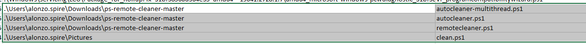
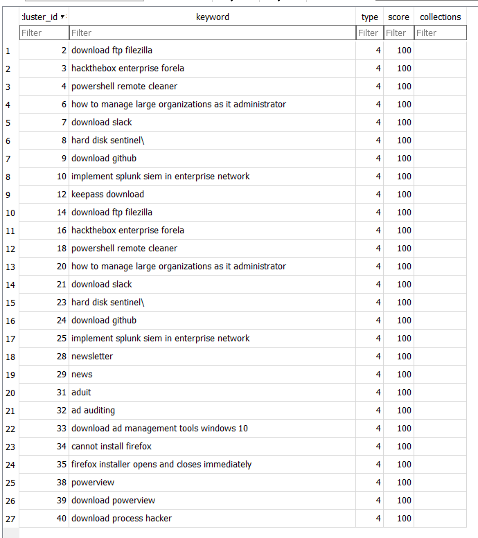
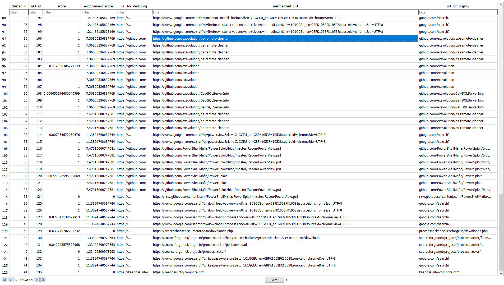
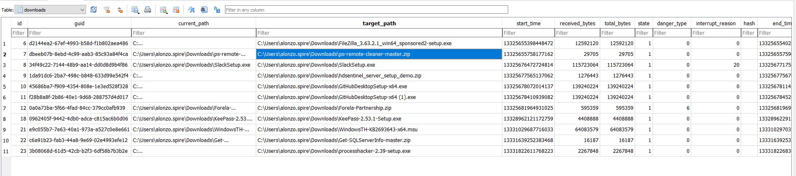
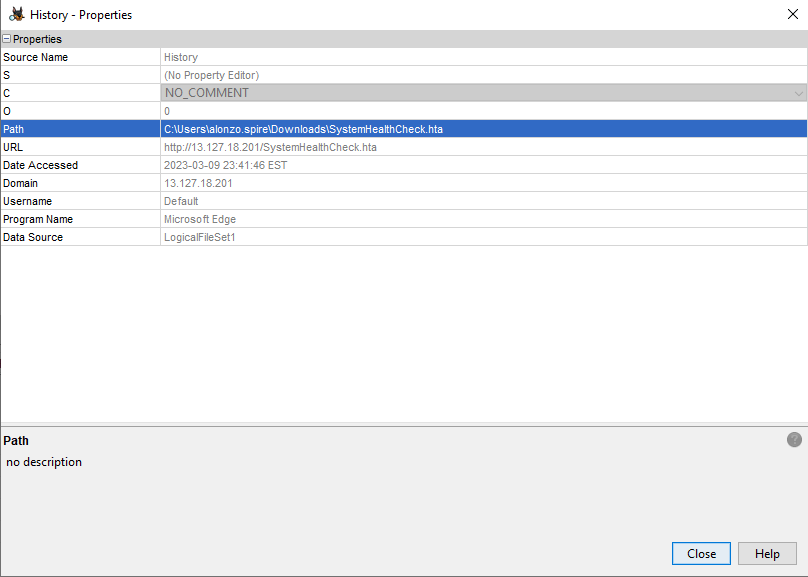
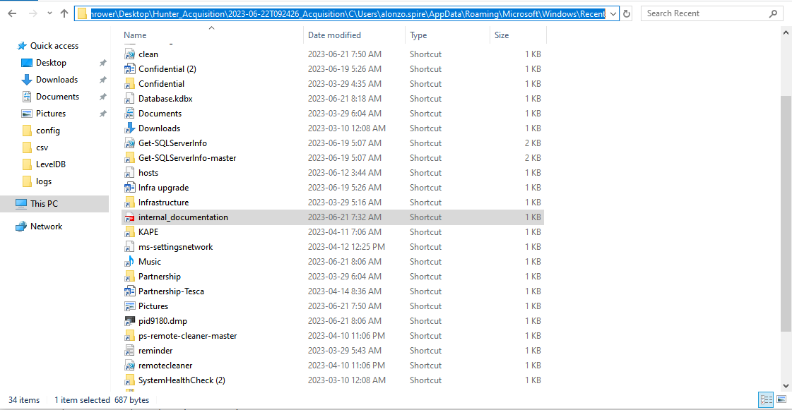

# Hunter

## Speech
```
A SOC analyst received an alert about possible lateral movement and credential stuffing attacks. The alerts were not of high confidence and there was a chance of false positives as the SOC was newly deployed. Upon further analysis and network analysis by senior soc analyst it was confirmed that an attack took place. As part of incident response team you are assigned the incident ticket. The network capture device had some performance issues from some time so we unable to capture all traffic. You are provided with the Artifacts acquired from the endpoint and the limited network capture for analysis. Now it's your duty to conduct a deep dive with the provided data sources to understand how did the incident occured.
```

## Analysis
### pcap
1. Some FTP, some TCP
2. We can extract the file from the FTP, we get three files : `Database.kdbx, keepassproc.zip, redacted-project.zip`
3. Zip file protected with password
4. filter with : ftp
    - Follow the first tcp :
    ```
    220 (vsFTPd 3.0.3)
    AUTH TLS
    530 Please login with USER and PASS.
    AUTH SSL
    530 Please login with USER and PASS.
    USER theyoungwolf
    331 Please specify the password.
    PASS TheLongNightIsComing
    230 Login successful.
    SYST
    215 UNIX Type: L8
    FEAT
    211-Features:
    EPRT
    EPSV
    MDTM
    PASV
    REST STREAM
    SIZE
    TVFS
    211 End
    PWD
    257 "/home/theyoungwolf" is the current directory
    TYPE I
    200 Switching to Binary mode.
    PASV
    227 Entering Passive Mode (13,235,18,128,83,52).
    LIST
    150 Here comes the directory listing.
    226 Directory send OK.
    CWD xchjfad
    250 Directory successfully changed.
    PWD
    257 "/home/theyoungwolf/xchjfad" is the current directory
    PASV
    227 Entering Passive Mode (13,235,18,128,23,93).
    LIST
    150 Here comes the directory listing.
    226 Directory send OK.
    CWD uk_campaigns
    250 Directory successfully changed.
    PWD
    257 "/home/theyoungwolf/xchjfad/uk_campaigns" is the current directory
    PASV
    227 Entering Passive Mode (13,235,18,128,196,251).
    LIST
    150 Here comes the directory listing.
    226 Directory send OK.
    MDTM Process Hacker 2.lnk
    213 20230621090341
    ```
    - FTP server IP : 13.235.18.128

### Kape
1. `EVTX` : 
    - In `System` : filter on 40970, we see bad username/password
    - Event 8015
    ```
    The system failed to register host (A or AAAA) resource records (RRs) for network adapterwith settings:
            Adapter Name : {ED3D164C-CC82-45A3-ABC5-375B190D9757}
            Host Name : Forela-Wkstn002
            Primary Domain Suffix : forela.local
            DNS server list :
                    172.17.79.4
            Sent update to server : <?>
            IP Address(es) :
                172.17.79.131
    The reason the system could not register these RRs was because the update request it sent to the DNS server timed out. The most likely cause of this is that the DNS server authoritative for the name it was attempting to register or update is not running at this time.
    You can manually retry DNS registration of the network adapter and its settings by typing 'ipconfig /registerdns' at the command prompt. If problems still persist, contact your DNS server or network systems administrator.
    ```
    - In defender Operational at 2023-06-21T12:33:55 : 
    ```
    Microsoft Defender Antivirus has detected malware or other potentially unwanted software.
    For more information please see the following:
    https://go.microsoft.com/fwlink/?linkid=37020&name=Trojan:Win64/Meterpreter.E&threatid=2147721833&enterprise=0
        Name: Trojan:Win64/Meterpreter.E
        ID: 2147721833
        Severity: Severe
        Category: Trojan
        Path: file:_C:\Users\alonzo.spire\notepad.exe; shellopencmd:_HKLM\SOFTWARE\CLASSES\txtfile\shell\open\command\\
        Detection Origin: Local machine
        Detection Type: Concrete
        Detection Source: System
        User: NT AUTHORITY\SYSTEM
        Process Name: Unknown
        Security intelligence Version: AV: 1.391.2013.0, AS: 1.391.2013.0, NIS: 0.0.0.0
        Engine Version: AM: 1.1.23050.3, NIS: 0.0.0.0
    ```

2. The `Amcache` : 
    - `..\Tools\zimmerman\net6\AmcacheParser.exe -f '.\2023-06-22T092426_Acquisition\C\Windows\AppCompat\Programs\Amcache.hve' --csv .\csv\ --csvf amcache.csv`
    - in `amcache_unassociatedFileEntries` we can filter for the name `owUjOMCY.exe` in order to find the sha1 of the malicious service created

3. The `MFT` :
    - ..\Tools\zimmerman\net6\MFTECmd.exe -f '.\2023-06-22T092426_Acquisition\C\$MFT' --csv .\csv\ --csvf mft.csv
    

4. The `Chrome history` :
    - `2023-06-22T092426_Acquisition\C\Users\alonzo.spire\AppData\Local\Google\Chrome\User Data\Default\History`
    
    
    
    - mail.zoho.eu (Zoho Mail (alonzo.spire@forela.co.uk))

5. With `Autopsy` :
    - Found powershell history in : `2023-06-22T092426_Acquisition/C/Users/alonzo.spire/AppData/Roaming/Microsoft/Windows/PowerShell/PSReadline/ConsoleHost_history.txt`
    ```
    Invoke-WebRequest -Uri https://raw.githubusercontent.com/olafhartong/sysmon-modular/master/sysmonconfig.xml -OutFile C:\Windows\config.xml
    cd ../
    sysmon64.exe –accepteula –i c:\windows\config.xml
    cd .\Pictures\
    powershell -ep bypass
    . .\clean.ps1
    Get-NetDomainController
    Get-NetDomainUsers
    Get-NetUsers
    Get-NetUser
    ```
    

6. FileZilla file :
    - recentservers.xml :
    ```xml
    <FileZilla3 version="3.63.2.1" platform="windows">
    <RecentServers>
    <Server>
    <Host>13.235.18.128</Host>
    <Port>21</Port>
    <Protocol>0</Protocol>
    <Type>0</Type>
    <User>theyoungwolf</User>
    <Pass encoding="base64">VGhlTG9uZ05pZ2h0SXNDb21pbmc=</Pass>
    <Logontype>1</Logontype>
    <PasvMode>MODE_DEFAULT</PasvMode>
    <EncodingType>Auto</EncodingType>
    <BypassProxy>0</BypassProxy>
    </Server>
    <Server>
    <Host>ypmlads.ftp.fileserver</Host>
    <Port>4825</Port>
    <Protocol>0</Protocol>
    <Type>0</Type>
    <User>cyberjunkie</User>
    <Pass encoding="base64">VWlvbnNrSEdUTERT</Pass>
    <Logontype>1</Logontype>
    <PasvMode>MODE_DEFAULT</PasvMode>
    <EncodingType>Auto</EncodingType>
    <BypassProxy>0</BypassProxy>
    </Server>
    <Server>
    <Host>13.45.67.23</Host>
    <Port>21</Port>
    <Protocol>0</Protocol>
    <Type>0</Type>
    <User>alonzo.spire</User>
    <Pass encoding="base64">VGhlQXdlc29tZUdyYXBl</Pass>
    <Logontype>1</Logontype>
    <PasvMode>MODE_DEFAULT</PasvMode>
    <EncodingType>Auto</EncodingType>
    <BypassProxy>0</BypassProxy>
    </Server>
    </RecentServers>
    </FileZilla3>
    ```
    - The first one is the one working
    - The second one seems to be one of the attacker because the username is cyberjunkie, apparently that didn't work because he changed

7. The prefetch files : `..\Tools\zimmerman\net6\PECmd.exe -d '.\2023-06-22T092426_Acquisition\C\Windows\prefetch\' --csv .\csv\ --csvf prefetch.csv`
    - We can seer KAPE.exe launched at 2023-06-22 09:24:25

8. Take a look at the evtx with `Chainsaw`
    - To see the service created on the system : 
    ```bash
    ~/…/Windows/System32/winevt/logs $ /opt/chainsaw/chainsaw_x86_64-unknown-linux-gnu search -t 'Event.System.EventID: =7045' ./
    ```
    - That give us that, which contain the exe used by the TA and the timestamp :
    ```
    Event:
    EventData:
        AccountName: LocalSystem
        ImagePath: '%systemroot%\owUjOMCY.exe'
        ServiceName: tFdj
        ServiceType: user mode service
        StartType: demand start
    System:
        Channel: System
        Computer: Forela-Wkstn002.forela.local
        Correlation: null
        EventID: 7045
        EventID_attributes:
        Qualifiers: 16384
        EventRecordID: 6135
        Execution_attributes:
        ProcessID: 720
        ThreadID: 864
        Keywords: '0x8080000000000000'
        Level: 4
        Opcode: 0
        Provider_attributes:
        EventSourceName: Service Control Manager
        Guid: '{555908d1-a6d7-4695-8e1e-26931d2012f4}'
        Name: Service Control Manager
        Security_attributes:
        UserID: S-1-5-21-3239415629-1862073780-2394361899-1104
        Task: 0
        TimeCreated_attributes:
        SystemTime: 2023-06-21T11:19:34.767824Z
        Version: 0
    Event_attributes:
    xmlns: http://schemas.microsoft.com/win/2004/08/events/event
    ```

9. The SRUM :
    - https://threadreaderapp.com/thread/1504491533487296517.html
    - https://www.magnetforensics.com/blog/srum-forensic-analysis-of-windows-system-resource-utilization-monitor/
    - `..\Tools\zimmerman\net6\SrumECmd.exe -f .\2023-06-22T092426_Acquisition\C\Windows\System32\SRU\SRUDB.dat -r \2023-06-22T092426_Acquisition\C\Windows\System32\config\SOFTWARE --csv .\csv\`
    ```
    Id;Timestamp;ExeInfo;ExeInfoDescription;ExeTimestamp;SidType;Sid;UserName;UserId;AppId;EndTime;DurationMs
    11953;2023-06-21 12:18;whoami.exe;04/14/2015 08:11:14 +00:00;LocalSystem;S-1-5-18;systemprofile;4;3381;2023-06-21 11:20;60003
    ```

10. In the folder : `2023-06-22T092426_Acquisition\C\Users\alonzo.spire\AppData\Roaming\Microsoft\Windows\Recent`
    - This folder contain the recent file consulted by the user
    

## Question
1. What is the mitre technique ID of the tactic used by the attacker to gain initial access to the system?
    > T1569.002
    - Brute force LOL
    - Service Execution
2. When did attacker gain a foothold on the system? (UTC)
    > 2023-06-21 11:19:34
    - Because I have hard time finding things with the evtx explorer I go on the linux and used chainsaw
    - cf. analyssi > kape > 8
3. What's the SHA1 hash of the exe which gave remote access to the attacker?
    > 23873bf2670cf64c2440058130548d4e4da412dd
    - cf. analyssi > kape > 2
4. When was whoami command executed on the system by the attacker? (UTC)
    > 2023-06-21 11:19:59
    - cf. analyssi > kape > 9
    - we can see the execution of a whoami, but the ExeTimestamp is wrong and the start timestamp is in 2015 which seems unlikely...
    - But we can take the end of execution timestamp and substract the time of execution in order to get the real execution start time
5. We believe the attacker performed enumeration after gaining a foothold. They likely discovered a PDF document containing RDP credentials for an administrator's workstation. We believe the attacker accessed the contents of the file and utilised them to gain access to the endpoint. Find a way to recover contents of the PDF file and confirm the password.
    > 
    - Internal_documentation.pdf seems the right one he is present in Documents and Desktop
    - We have two entry number, 3740 (for the desktop one) and 205424 (for the documents one)
    - also one pdf in sysmon fodler... entry number 154533, `CB4C8D1F234371AA2582D2ED2BBE803B30B2CB614BBCE0C59A6FA49B3538FE0603DF0FF9CC9D3D1D921E35C9C76F5EC2CF8D529856C5EAD8840734C613D994192B8DCA8B00000000000000000000000000000000.pdf` (weird name)
    - 
6. At what time did the adversary initially authenticate utilizing RDP? (UTC)
    > 2023-06-21 11:44:52
    - Microsoft-Windows-TerminalServices-RemoteConnectionManager%4Operational.evtx
    - EventId 1149, only one, alonzo.spire from 172.17.79.133
    - 2023-06-21 7:44:51 but doesn't work... 11:44:51 (system logged) doesn't work either
    - this log doesn't mean "authentication succeed" cf : https://ponderthebits.com/2018/02/windows-rdp-related-event-logs-identification-tracking-and-investigation/
    - To find open Security.evtx and filter for 4624 eventId then look for `Logon Type: 10` around the time find in the previous evtx
7. The security team have located numerous unusual PowerShell scripts on the host. We believe the adversary may have downloaded the tooling and renamed it to stay hidden. Please confirm the original name of the malicious PowerShell script utilised by the attacker.
    > Powerview.ps1
    - cf. Analysis > Kape > MFT
    - we know it's downloaded from https://github.com/exevolution/ps-remote-cleaner
    - evtx : Microsoft-Windows-PowerShell%4Operational we can see a lot of execution, this execution come from the clean.ps1 (stored in C:\Users\alonzo.spire\Documents) in the first execution we see the original file name which is the answer
8. We believe the attacker enumerated installed applications on the system and found an application of interest. We have seen some alerts for a tool named Process Hacker. Which application were they interested it?
    > Keepass
    - cf. Analysis > pcap > ftp
9. What was the name of the initial dump file?
    > pid9180.dmp
    - We know he dumped with process hacker
    - cf. analysis > kape > 10
10. The attackers downloaded a custom batch script from their C2 server. What is the full C2 domain url from where it was downloaded?
    > 
    - 
11. Whats the MD5 hash of the batch script?
    > 
    - 
12. The attackers tried to exfiltrate the data to their FTP server but couldn't connect to it. The threat intelligence team wants you to collect more TTPs (Tactics, Techniques, and Procedures) and IOCs (Indicators of Compromise) related to the adversary. It would be really helpful for the TI team if you could provide some useful information regarding the attacker's infrastructure being used. Can you find the domain name and the password of their FTP server?
    > ypmlads.ftp.fileserver:UionskHGTLDS
    - cf. analysis > kape > 6
13. Upon failing their initial attempt to exfiltrate data, the SOC team observed further FTP data being sent to a cloud environment. It is believed that the attackers spun up an instance on the cloud and ran another FTP server hastily to exfiltrate the collected data. Please try to find more information regarding the adversary's infrastructure, so the Threat Intel team can better understand which group might be behind this attack. What is the remote path on the adversary's server where they stored the exfiltrated data?
    > /home/theyoungwolf/xchjfad/uk_campaigns
    - cf. Analysis > pcap we can see it in the ftp stream
14. For how long did the tool used for exfiltrating data, run before being closed? (Answer in seconds)
    > 
15. The security team highlighted that information pertaining to a sensitive project may have been exfiltrated by the attackers and are now worried about the threat of extortion. Which directory did the attacker manage to stage and then exfiltrate?
    > C:\Users\alonzo.spire\Documents\REDACTED_SENSITIVE
    - Determined based on the name of the zip find in the ftp file we recover with pcap
16. What specific CVE did the attacker exploit to gain access to the sensitive contents?
    > 
17. Find a way to access the sensitive information. The information was related to development of an internal application. What is the suggested name for this app?
    > 
18. SSN were also part of the sensitive project which was exfiltrated by the attacker. What is the SSN number of Arthur Morgan from zeeindustries?
    > 
19. We believe the domain admin credentials have been leaked in this incident. Please confirm the Domain Admin password?
    > 