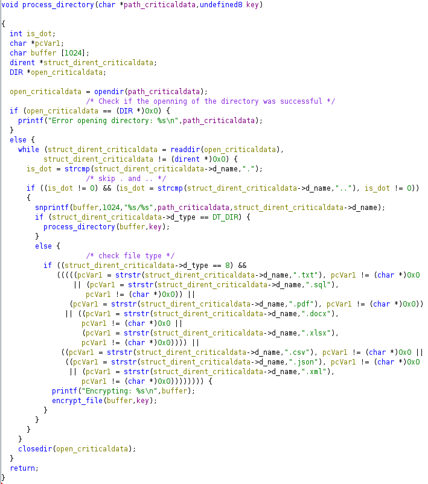
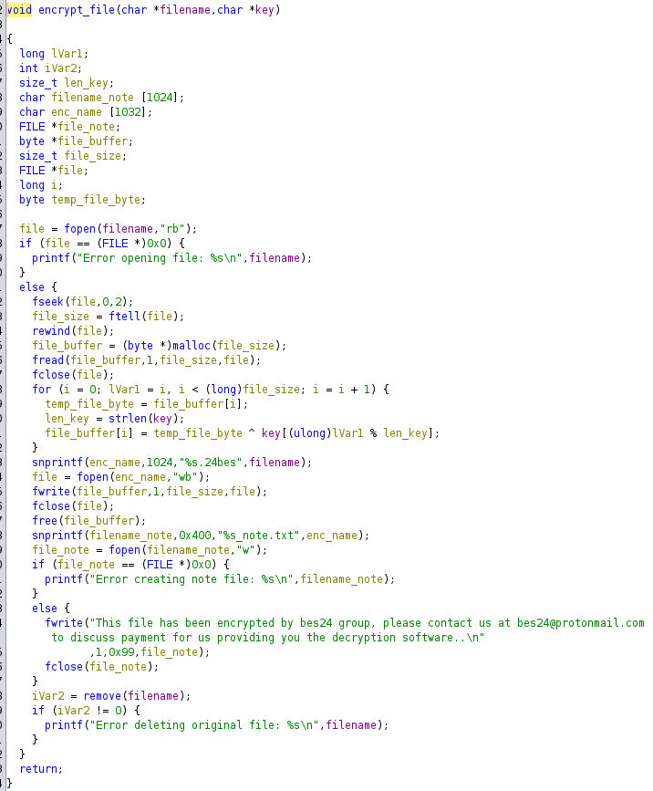

# Lockpick

## Speech
```
Forela needs your help! A whole portion of our UNIX servers have been hit with what we think is ransomware. We are refusing to pay the attackers and need you to find a way to recover the files provided. Warning This is a warning that this Sherlock includes software that is going to interact with your computer and files. This software has been intentionally included for educational purposes and is NOT intended to be executed or used otherwise. Always handle such files in isolated, controlled, and secure environments. Once the Sherlock zip has been unzipped, you will find a DANGER.txt file. Please read this to proceed.
```

## Analysis
We have encrypted files and a binary file
1. First we go to the main, the main is launching a function with two arguments `process_directory("/forela-criticaldata/","bhUlIshutrea98liOp");`
2. The `process_directory` function:
    - I changed the name of the arguments to : `char *path_criticaldata,undefined8 garbage_string` because I know the first argument is the path the "criticaldata" folder and the second string is something I don't know yet
    - We have the `opendir` function with the first argument given, so we open the criticaldata folder
    - Then a check to know if the openning is sucessful or not
    - After that a loop using [readdir](https://man7.org/linux/man-pages/man3/readdir.3.html), the result of this function is a structure of type `dir_ent`
    - iVar1 is checking if the `d_name` of the structure (Null-terminated filename) is equal to '.' or '..'
        - If we have '.' or '..' the program use [snprintf](https://www.geeksforgeeks.org/snprintf-c-library/) to write the fullpath to a buffer
        - the following if check the `d_type` which is the type of file, by looking at the definition of the [dirent](https://github.com/lsds/musl/blob/master/include/dirent.h) we can see the numbers linked to the different `d_type`, here the number is 4 which is a directory
        - These lines are made for skipping the '.' and '..' file
    - The `else if` is a lot more interesting we can see a check for `d_type` equal to `8` which is `DT_REG` (regular file)
        - then we have a call to [strstr](https://cplusplus.com/reference/cstring/strstr/) which is a function returning a pointer to the first occurrence of the second argument (both of the arguments of this function are strings), we notice that each tested string are file extensions
        - After testing the file extensions we have a message (printf) saying the file will be encrypted and finally a call to a function called `encrypt_file`, which probably encrypt files, this function is called with the file and the `garbage_string` (second argument) so this garbage is probably the encryption key.
    - My final function looks like that :
    
3. The `encrypt_file` function:
    - First the function open the file and check that the file is successfuly opened
    - after that (in the `else` statement) we have a lot of interesting function, let's take a look at each of them :
        - [fseek( FILE* stream, long offset, int origin )](https://en.cppreference.com/w/c/io/fseek) - move the file pointer
        - [long ftell( FILE *stream )](https://en.cppreference.com/w/c/io/ftell) - return the file pointer position
        - [rewind(FILE *stream)](https://www.tutorialspoint.com/c_standard_library/c_function_rewind.htm) - go back to the beginning of the file
        - [fread(void *ptr, size_t size, size_t nmemb, FILE *stream)](https://www.tutorialspoint.com/c_standard_library/c_function_fread.htm) - read data to an array
    - with these functions we can take a look at the code in order to understant what happened :
    ```c
    fseek(file,0,2); # the first parameter is the file, the second is the number of bytes we want to move (in this case we want to move of 0 bytes), and the third parameter can take three value, 0 for the beginning of the file, 1 for the current position and 2 for the end of the file, so with this line we go to the end of the file
    
    local_30 = ftell(file); # we get the current position in the file, the end, and store it

    rewind(file); # we go back to the beginning

    local_38 = malloc(local_30); # we create a buffer of the size of the file

    fread(local_38,1,local_30,file); # we read bytes 1 by 1 (second arg), from the file (4th arg), and we read as much as the 3rd arg, that mean the size of the file

    fclose(file); # close the file
    ```
    - All these lines to store the file in a buffer :)
    - I made some cleaning and changed the `void *file_buffer` type to be a byte pointer, because we know this buffer store the byte of the file
    - change the type of `i` (the iterator of the loop) to be a long (to clean some casting)
    - the loop is iterating each byte of the buffer, the first line is storing the byte in a temp var in order to xor this byte with a char of the key
    - the var `lvar1` is i but I don't know how to get rid of it
    - The `snprintf` is copying the filename, with `.24bes` added at the end, in a buffer
    - This buffer is open via `fopen` and the xored file content is written to this buffer/file
    - The following `snprintf` and `fopen` create a new file, named like that : `original.filename.24bes_note.txt` and a text containing a mail is written to this file
    - at the end the original filename is deleted
    And finally I have this function :
    

## Questions
1. Please confirm the encryption key string utilised for the encryption of the files provided?
    > bhUlIshutrea98liOp
2. We have recently recieved an email from wbevansn1@cocolog-nifty.com demanding to know the first and last name we have him registered as. They believe they made a mistake in the application process. Please confirm the first and last name of this applicant.
    > Walden Bevans
3. What is the MAC address and serial number of the laptop assigned to Hart Manifould?
    > E8-16-DF-E7-52-48, 1316262
4. What is the email address of the attacker?
    > bes24@protonmail.com
5. City of London Police have suspiciouns of some insider trading taking part within our trading organisation. Please confirm the email address of the person with the highest profit percentage in a single trade alongside the profit percentage.
    > fmosedale17a@bizjournals.com, 142303.1996053929628411706675436
6. Our E-Discovery team would like to confirm the IP address detailed in the Sales Forecast log for a user who is suspected of sharing their account with a colleague. Please confirm the IP address for Karylin O'Hederscoll.
    > 8.254.104.208
7. Which of the following file extensions is not targeted by the malware? .txt, .sql,.ppt, .pdf, .docx, .xlsx, .csv, .json, .xml
    > .ppt
8. We need to confirm the integrity of the files once decrypted. Please confirm the MD5 hash of the applicants DB.
    > f3894af4f1ffa42b3a379dddba384405
9. We need to confirm the integrity of the files once decrypted. Please confirm the MD5 hash of the trading backup.
    > 87baa3a12068c471c3320b7f41235669
10. We need to confirm the integrity of the files once decrypted. Please confirm the MD5 hash of the complaints file.
    > c3f05980d9bd945446f8a21bafdbf4e7