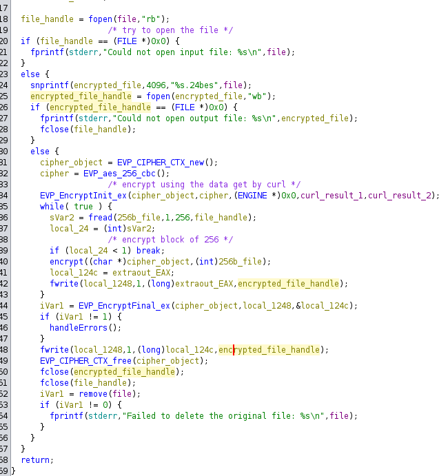

# Lockpick2.0

## Speech
```
We've been hit by Ransomware again, but this time the threat actor seems to have upped their skillset. Once again a they've managed to encrypt a large set of our files. It is our policy NOT to negotiate with criminals. Please recover the files they have encrypted - we have no other option! Unfortunately our CEO is on a no-tech retreat so can't be reached. Warning This is a warning that this Sherlock includes software that is going to interact with your computer and files. This software has been intentionally included for educational purposes and is NOT intended to be executed or used otherwise. Always handle such files in isolated, controlled, and secure environments. Once the Sherlock zip has been unzipped, you will find a DANGER.txt file. Please read this to proceed.
```

## Analysis
1. let's do a string on the file, we see it's an UPX package, extract it we `upx -d update`

### main
- we have two call to [OPENSSL_init_crypto](https://docs.openssl.org/3.1/man3/OPENSSL_init_crypto/#name) it's signature should be : `int OPENSSL_init_crypto(uint64_t opts, const OPENSSL_INIT_SETTINGS *settings);` we don't have the `OPENSSL_INIT_SETTINGS` so let's put int instead of const, because our function take 0 for OPENSSL_INIT_SETTINGS then no option are given to the function

- can't find the opts corresponding to 2 and 0xc...
- A call is made to `get_key_from_url` let's dive in this function

#### get_key_from_url
- First thing we have a new curl inited (see [curl global init](https://curl.se/libcurl/c/curl_global_init.html)), the option 3 seems to be CURL_GLOBAL_ALL after some research
- Then an handle is created : [curl_easy_init](https://curl.se/libcurl/c/curl_easy_init.html)
- a call is made to `xor_cipher`
    - This call is made with two global variables (`K1` and `HESB`) and between those a local variable
    - the len of the 3rd param is stored in a variable, then a variable is used as an iterator for a while loop
    - in the while loop we keep the len of the param 1 in a var and while i is inferior to len of param1 continue
    - the loop is xoring the content of the `K1` with the content of `HESB` and store the result in the local var
    - back to the previous function
    - We can modify the variable that store the xor result, if we right click on K1 and select `retype global` we can see this var is 19 char long so let's modify the variable to be char[19]
- The variables local_14 local_18 local_1c and local_20 are useless, but the same value is used in the [curl_easy_setopt](https://curl.se/libcurl/c/curl_easy_setopt.html) and the [options](https://gist.github.com/jseidl/3218673), let's create a list corresponding to the number of `curl_easy_setopt`:
    - in the `Data Type Manager` right click on `update`(the reversed binary) then `new -> enum`
    - Complete the enum with the numbers and the name of the options
    
    - save then edit the curl_easy_setopt signature
    
    - Not perfect but replace the hex value by the curl options
    - also need to override the signature for the CURLOPT_WRITEFUNCTION to put a `*` pointer as parameter
    - With some cleanup I get a function wich do a curl and write the result to a file
    - after the check if the curl was sucessful we have a [memcpy](https://www.tutorialspoint.com/c_standard_library/c_function_memcpy.htm) which copy the content of the file to param1, a buffer (length of 0x20)
    
    - Then param2 is modified and take the value of two var which has not been used previously, but they are just after the curl_result_file in the stack, maybe this result is longer and this var are part of the result file
    - By modifiying the `curl_result_file` var to be 48 long we have a better decompilation
    
- back in `main` we can modify the name of the var containing the result of `get_key_from_url` we know the first parameter will contain the first 32 bytes of the result and the second parameters will contain the next 16 bytes so we can modify the data types of each var
- I have something like that :

- The first might be used to iterate the first param/first var and the second loop the second param, let's dive in `handle_directory` to see the use of these variables
    - We have that :
    
    - we know param1 is equal to '/share/' and this folder is opened at the beginning of the function, which gave us a dirent structure
    - `snprintf` is used to create a file /share/countdown.txt of 4096 bytes
    - then the function `download_lyrics` will take two parameters, a pasterbin url and the file we just created, if we go in this function we see some call to curl, I assume (I'll not reverse completly this function) this function will write what is stored at this address in this file
    - The while is ietrating through the folder
    - The name of the current iterated file is written to a buffer with `snprintf`
    - The function [stat](https://man7.org/linux/man-pages/man2/stat.2.html) is used to get information about the file 
    - This line : `if ((stat_result == 0) && ((file_informations.st_mode & 0xf000) == 0x4000))` is testing if the stat was successful and is testing the `st_mode`, from this [blog](https://aljensencprogramming.wordpress.com/tag/st_mode/):
    > The file’s type and it’s permissions are encoded together in one field in the stat structure, the st_mode field. The file’s mode is 16 bits in length, with the four high-order bits representing the file’s type, and the remaining lower 12 bits representing access permissions and their modifiers.
    - with the st_mode we get the right of the file and with the & we keep only the beginning so the type of the file then we compare to 4000 which is a folder, so this if is used tto test if the current file is a folder
    - if the current file is a folder we have two more test, one to test if it's the current folder, the '.', and one to see if it's '..'
    - if not a folder then continue with the function `is_target_extension` and give to this function the name of the current file handled by the while loop
        - In the `is_target_extension` function we see a lot of references to global variable lets transform them inb C string to be easily readable
        
        - This function compare the extension of the file with a list of known extensions and return 1 if the extensions is known
    - The file is send in `encrypt_file` function if the extension is known, also the data get with curl are pass to this function, the `handle_directory` looks like that at the end :
    
    - Let's clean the `encrypt_file` function
        - I renamed some variable and put some comments to get an idea of what's going on
        
        - This function is encrypting file with AES 256 CBC and delete the unencryptred file
- Back to main, if we continue we see multiple call to `xor_cipher` with a different global everytime (K2, K3, etc...) the xored content is then print via a for loop and putchar and a sleep of 1s


## Questions
1. What type of encryption has been utilised to encrypt the files provided?
    > AES
2. Which market is our CEO planning on expanding into? (Please answer with the wording utilised in the PDF)
    > Australian Market
3. Please confirm the name of the bank our CEO would like to takeover?
    > Notionwide
4. What is the file name of the key utlised by the attacker?
    > updater
5. What is the file hash of the key utilised by the attacker?
    > 950efb05238d9893366a816e6609500f
6. What is the BTC wallet address the TA is asking for payment to?
    > 1BvBMSEYstWetqTFn5Au4m4GFg7xJaNVN2
7. How much is the TA asking for?
    > £1000000
8. What was used to pack the malware?
    > upx