# Lovely Malware

## Speech
```
An employee at NeirCyber Security discovered a suspicious file named employee_benefits.exe on their desktop. The employee found the file after returning from lunch and immediately reported it to the IT security team, suspecting that it could be malicious. The objective is to reverse engineer the file and dissect its inner workings. This is a warning that this Sherlock includes software that is going to interact with your computer and files. This software has been intentionally included for educational purposes and is NOT intended to be executed or used otherwise. Always handle such files in isolated, controlled, and secure environments. One the Sherlock zip has been unzipped, you will find a DANGER.txt file. Please read this to proceed.
```

## Analysis
Go on Windows and we'll use IDA

#### Main function
1. We go in the `main`
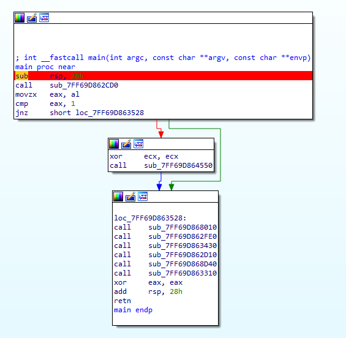
2. I put a breakpoint on the first line and begin the debugging
3. In the function : `sub_7FF69D862CD0` we have `lea rcx, unk_7FF69D86EEF8` and after this a call to `sub_7FF69D863550` which contain a variable named : `byte_7FF69D86F128` with the string **Love_Her** in it, after this we get :
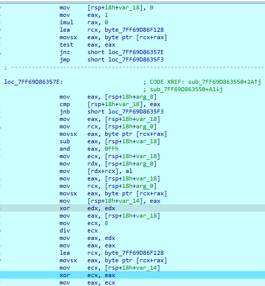
4. We see the function recovering the string "Love_Her" and doing some XOR operation, by going to the second XOR (because the first one is only cleaning the register) the first this loop does is xoring 4C with 0B, 4C is *L* (first byte of Love_Her) and 0B is a vertical tab (it's the first byte of `unk_7FF69D86EEF8`). So the program is xoring with Love_Her.
5. I stop the debugger and relaunch it but this time I goes over the first function call in order to see what is the result of the xor operation. And now we have `Global\On3_S1d3d_hard` in `unk_7FF69D86EEF8`
6. I made some renaming : for example `sub_7FF69D862CD0` became `func_mutex`, `unk_7FF69D86EEF8` became `var_global_one_sided` and `sub_7FF69D863550` to `loop_xor_global_one_sided`
7. After the function xoring in order to obtain the `Global\On3_S1d3d_hard` string we can go on the `.data` section and see that only this string is xored, also we can see that the strings are XREF in [TlsCallbback](https://unprotect.it/technique/tls-callback/) function, this is why we don't see all these strings in Ghidra, they are populated at the thread creation
> When we see something like `cs:` we can double click on this address and then use the right click `offset` to see what DLL function is called
8. I jump over the func_mutex, I saw some call to ntdll and kernel32, but it looks like some function are used to load the dll and some function of these dll are called but I don't really understand what happened :/
9. I rename to not loose myself in the function name:
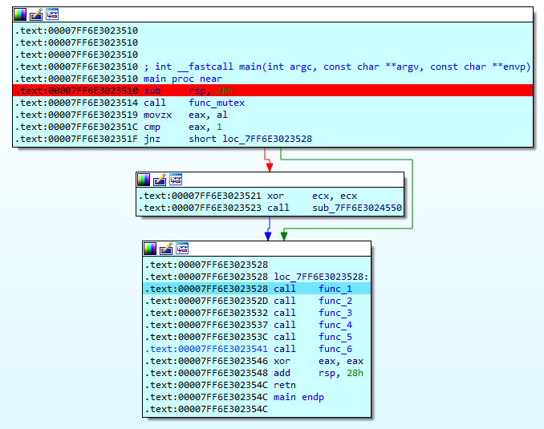
10. In 
    - func_1 --> we have 4 call
    - func_2 --> a compare and a different call if the compare is sucessfull or not
    - func_3 --> 3 call to the loop_xor_global_one_sided and then 5 call to different functions
    - func_4 --> 2 call to the loop_xor_global_one_sided
    - func_5 --> a compare then a lot of call to different function
    - func_6 --> 3 call to the loop_xor_global_one_sided and then a lot of call to different function
So we can conclude that the function loop_xor_global_one_sided is a function to xor with Love_Her and different strings will be xored along the execution, so i rename this function to `xor_love_her`

#### func_1
11. In func_1 I begun by stepping over all the instruction of this function to see if something happens, after stepping over the third function my computer shuted down :D so something is shutting down the computer for some reason
12. I renamed this function to `shutdown_computer` and step in to see what it does
13. the call to the different external dll are referenced by offset, 
    - we can find them via IDA, 
    - for example in the function `shutdown_computer` we have that :
    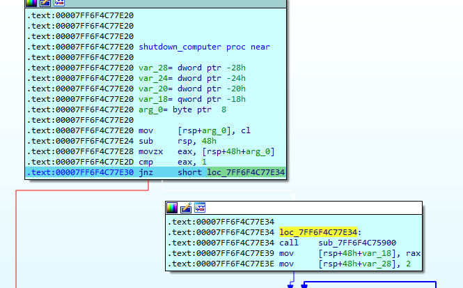
    - We go in the first call and we have :
    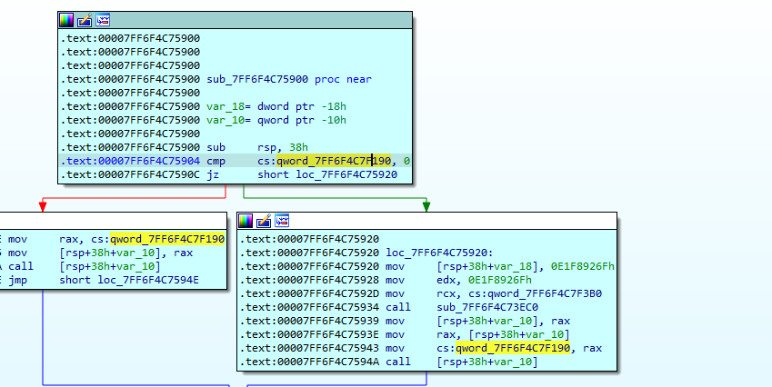
    - we can double click on the `cs:qword_7FF6F4C7F190` and there by putting the mouse over the value at this address we see that this value is and address to the kernel32 function "getcurrentprocess", we can right click on that on click on `offset kernel32...`
    - We can do that for all the adresses pointing to offset of DLL
    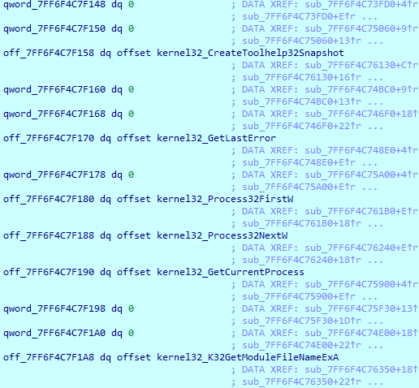
    - finally we can rename the call :
    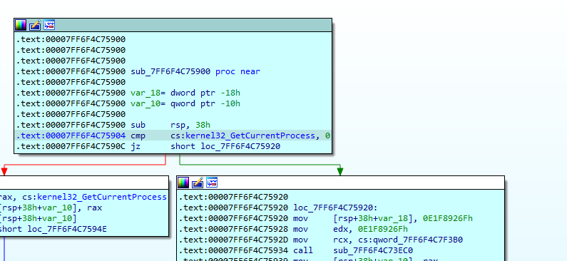
14. Back in `shutdown_computer`, jump over first call because this call seems to get the current process name, jump over the second call (after a loop) then go in this because a string is xored in this func we can check it, we can see this string have been decoded :
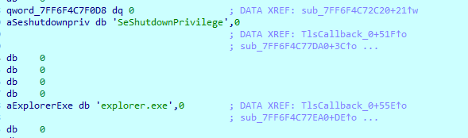
15. The following call xor some string, at least the string `user32.dll` but no shutdown for the moment
16. Enter the last call of the shutdown_computer function, and step over the first call, go to the : `call [rsp+48h+var_10]` and if we take a look at RAX we see the value : `user32_ExitWindowsEx`, finally if we step over we exit :) we found the function called for shuting down the computer
> to bypass this we can simply modify the zero flag at this line in the shutdown function : `jnz short loc_7FF64F3D7E34` 
17. I don't know what the last function of the func_1 is doing

#### func_2
18. this one looks pretty simple, we see the first function is decoding the string shell32.dll then calling loadlibrary
19. The next one is harder, a lot of call to other functions... let's just step over it
20. After steping over the program stop, and a notepad opened with information about our files being encrypted, etc. So the whole ransomware take place in this function...
21. Back in this function we can step over most of the thing, I just step over to have an overview of the execution, I rename what I can (the second function of func_2 is renamed ransom)
22. After some debugging i found this :
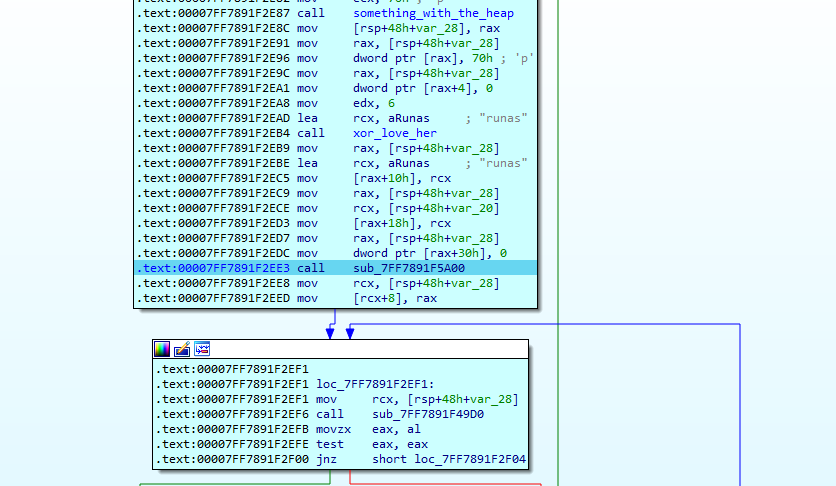
23. When we steped over the function a window asking for privileges appear, this must be the runas, to run as admin
24. The next function call is a mystery then the following is the ask of the admin priv
25. After a free heap function I encounter a function which close the program... Let's go back there
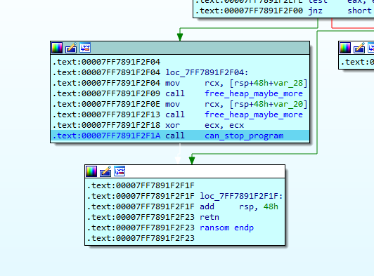
26. Let's dive in. A function return kernel32 ExitProcess and if we continue the process exit...
27. I put a breakpoint to dodge this function and continue

#### func_3
28. I go in func 3 and step over to decode some string, which give me the following :
`cmd.exe /c vssadmin.exe Delete Shadows /All /Quiet & bcdedit /set {default} recoveryenabled No & bcdedit /set {default} bootstatuspolicy ignoreallfailures`

#### func_4
29. I don't understand... Seems to xor some string but give nothing...

#### func_5
30. A lot of call, some that I don't understand and some that decode some string, after some remaining I get this :
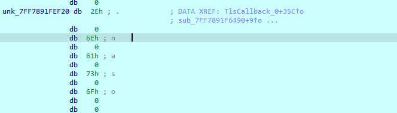
31. We notice that this string just get decoded, and it's the extension added by the ransomware, we know it because we have one encrypted file (with this extension)
32. A bit after we have the string `Users\*` which could be the folder scan for encryption
33. After some step over I encounter a very long function, which i skip and that took time to get back the debugger, and by checking the files in the users folder I now have encrypted file, so this function is encrypting
34. rename this function and rerun to this point to enter this function
DONT REALLY KNOW MORE IN THIS FUNC

#### func_6
35. Enter in this one, at the beginning we have a call to the xor function, and after it we have xor a buffer containing `192.168.1.104`
36. After the following we have another xor call and we get this string : "{',27h,'Name',27h,' : %s , ',27h,'Computer',27h,' : %s , ',27h,'Proc',27h,' : %s , ',27h,'Key',27h,' : %s , ',27h,'Id',27h,' : %s}"
37. The next xor give us the important.txt string

## Recovering
1. We'll recover the given file from the pcap file, first go in the pcap and add this filter : `ip.addr == 192.168.1.104`
2. In a packet sent to this addr we have : `{'Name' : vboxuser , 'Computer' : WINDOWS10 , 'Proc' : AMD Ryzen 7 6800HS with Radeon Graphics, 'Key' : ZcxYj5wFbcbbd4/mDhQRSQMfcqoFsRywp9+qPVeUUwA= , 'Id' : ivIeKXzjdWTq6jrQe/WrgKR07eDhyY4XttK2GY773+U=}`
3. Go in cyberchef and add the 

## Questions
1. What is the SHA256 hash of the malware?
    > 83cb5e8b7455fcb3b6c2d45269b08b3ae003dfed4ce8ca942cd007c1ebf17cf2
    - `sha256sum Update.exe`
2. The malware uses a global mutex to ensure that only one instance of it is being executed at the same time. What is the name of the mutex?
    > Global\On3_S1d3d_hard
    - 
3. The malware uses a decryption routine to decrypt its important strings. What is the decryption key used for that?
    > Love_Her
    - 
4. The malware checks the parent process to see if it started normally or under a debugger. What is the expected name for the parent process?
    > explorer.exe
    - 
5. The malware tries to turn off the computer if it suspects it is running a debugger. What is the Windows API used for that?
    > ExitWindows
    - 
6. The malware targets a specific directory and its subdirectories in the drive where the Windows OS is installed. What is the name of this directory?
    > Users
    - 
7. Which among these file extensions does the malware not target {png, docx, exe, 7z, zip}?
    > .exe
    - 
8. What is the encryption algorithm used for encrypting files? Algorithm-KeyLength?
    > AES-256
    - 
9. Before the malware begins its encryption process, it attempts to disable all methods of recovering the original data. What is the full shell command executed for this?
    > cmd.exe /c vssadmin.exe Delete Shadows /All /Quiet & bcdedit /set {default} recoveryenabled No & bcdedit /set {default} bootstatuspolicy ignoreallfailures
    - 
10. Once the malware encrypts files, it sends info about the key used and the ID of the victim. Please provide the format used for this?
    > {'Name' : %s , 'Computer' : %s , 'Proc' : %s , 'Key' : %s , 'Id' : %s}
    - 
11. What is the IP and port utilized by the malware author?
    > 192.168.1.104:8000
    - 
12. What is the extension added to the encrypted files?
    > .naso
    - 
13. What is the Bitcoin address used by the malware author?
    > bc1qntgwduujdjnfv6txwxugdsx6nw5mfhgqa4nn82
    - 
14. Can you decrypt the file provided as an attachment and provide its SHA256 hash?
    > 
    - 