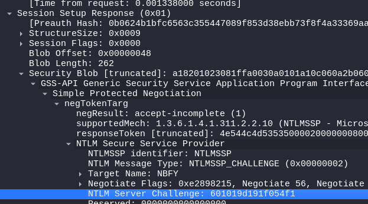
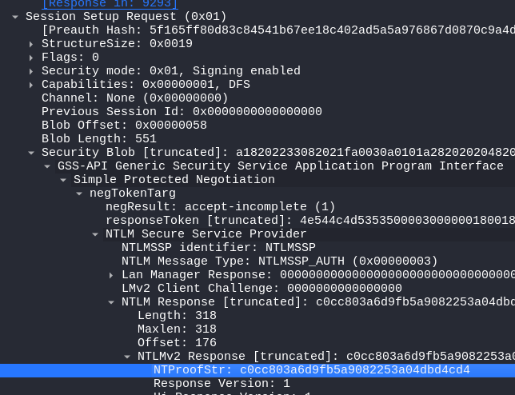

# Noxious

## Speech
```
The IDS device alerted us to a possible rogue device in the internal Active Directory network. The Intrusion Detection System also indicated signs of LLMNR traffic, which is unusual. It is suspected that an LLMNR poisoning attack occurred. The LLMNR traffic was directed towards Forela-WKstn002, which has the IP address 172.17.79.136. A limited packet capture from the surrounding time is provided to you, our Network Forensics expert. Since this occurred in the Active Directory VLAN, it is suggested that we perform network threat hunting with the Active Directory attack vector in mind, specifically focusing on LLMNR poisoning.
```

## Analysis
1. First a look at the protocol hierarchy

2. We had the filter `udp.port == 5355` in wireshark, to see only the LLMNR traffic, also we know LLMNR was directed towards `Forela-WKstn002` with the IP `172.17.79.136`, so let's find who talk to him via LLMNR, we see only one `172.17.79.135`
3. Then I filtered with `ip.addr == 172.17.79.135` to have more info on the attacker, in the DHCP packet we can find the hostname
4. With the same filter we can take a look at evertyhing done by the attacker, and we notice the use of the RDP protocol, so the attacker as probably successfuly gain access to the hash and the password of the user

## Questions
1. Its suspected by the security team that there was a rogue device in Forela's internal network running responder tool to perform an LLMNR Poisoning attack. Please find the malicious IP Address of the machine.
    > 172.17.79.135
2. What is the hostname of the rogue machine?
    > kali
    - Cf. Analysis > 3
3. Now we need to confirm whether the attacker captured the user's hash and it is crackable!! What is the username whose hash was captured?
    > john.deacon
    - Cf. Analysis > 4
4. In NTLM traffic we can see that the victim credentials were relayed multiple times to the attacker's machine. When were the hashes captured the First time?
    > 2024-06-24 11:18:30
    - Add the timestamp to wireshark : `View > Time display format > UTC DATE`
    - filter on `ntlmssp` the `NTLMSSP_NEGOTIATE` gave us the information
5. What was the typo made by the victim when navigating to the file share that caused his credentials to be leaked?
    > DCC01
    - We can see the victim .136 asking for this name in broadcast by filtering with `llmnr`
6. To get the actual credentials of the victim user we need to stitch together multiple values from the ntlm negotiation packets. What is the NTLM server challenge value?
    > 601019d191f054f1
    - Let's go back in the packet 9291 which is one of the packet of the question 4 (it's the moment the attacker get the hash)
    - The packet 9291 is the one containing the challenge for the client
    
7. Now doing something similar find the NTProofStr value.
    > c0cc803a6d9fb5a9082253a04dbd4cd4
    - NTProofStr is the proof that the client resolve the challenge
    - We can find it in the following packet (9292)
    
8. To test the password complexity, try recovering the password from the information found from packet capture. This is a crucial step as this way we can find whether the attacker was able to crack this and how quickly.
    > NotMyPassword0k?
    - We need a file with the following information : `User::Domain:ServerChallenge:NTProofStr:NTLMv2Response(without first 16 bytes)`
    - The NTLMv2 Response is with NTProofStr we just have to get rid of the first 16 bytes(32 characters)
    - Then we can crack with hashcat : `Hashcat -a0 -m5600 hashfile.txt rockyouwordlist.txt`
9. Just to get more context surrounding the incident, what is the actual file share that the victim was trying to navigate to?
    > \\DC01\DC-Confidential
    - filter smb2 and scroll