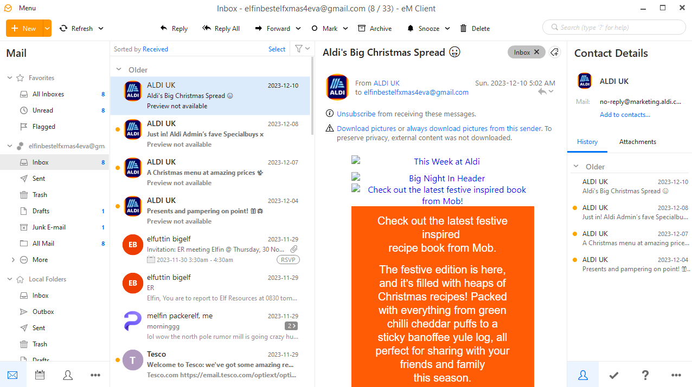
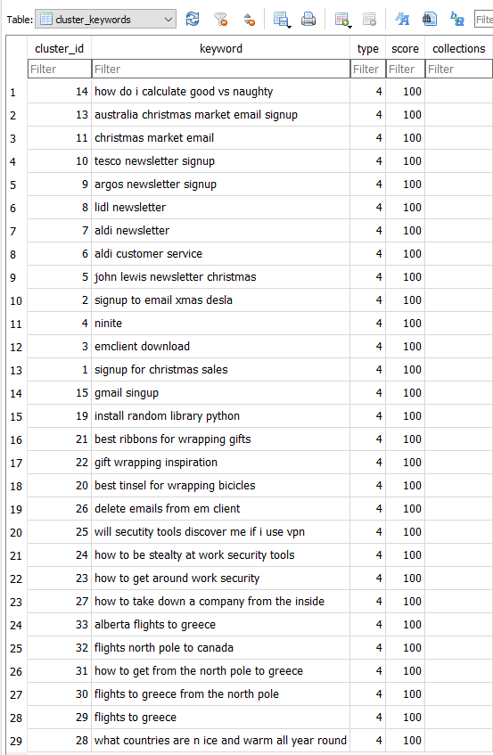
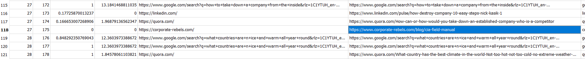
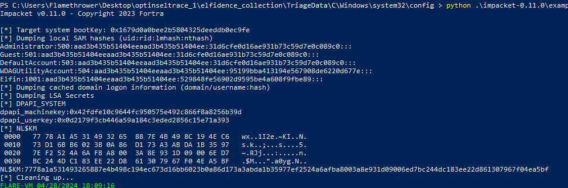

# OpTinselTrace 1

## Speech
```
An elf named "Elfin" has been acting rather suspiciously lately. He's been working at odd hours and seems to be bypassing some of Santa's security protocols. Santa's network of intelligence elves has told Santa that the Grinch got a little bit too tipsy on egg nog and made mention of an insider elf! Santa is very busy with his naughty and nice list, so he’s put you in charge of figuring this one out. Please audit Elfin’s workstation and email communications.
```

## Analysis
1. After extracting the 7zip file we get two folder `LiveResponse` and `TriageData`
    - In `LiveResponse` we see files with `CrowdResponse` at the beginning of the name, it's a community tool of crowdstrike (can see that [here](https://forensictools.dev/listing/crowd-response/))
    - In the `TriageData` we have some data from the Elfin's disk, i'll begin there
2. In begin with triage because the scenario tell us we must look at Elfin's mail and I think looking at his personnal folder should give us the information we want
3. After looking in the different folder I find two interesting folder in : `optinseltrace_1\elfidence_collection\TriageData\C\users\Elfin\Appdata\Roaming`
    - the top-secret folder contain a zip and an ELF file, let's keep that in mind
    - then the `eM Client` folder seems interesting, I put the name on google and I get [this](https://en.wikipedia.org/wiki/EM_Client)
4. In the eM Client folder I have logs file but also a folder with a name ressembling a UID and also some archive, I want to install the software because I think I can recover all that with the software.
5. After installing the software I launch it, and clicked on cancel when ask to enter email, the soft is launched.
    - Now I want to import the Elfin's data
    - I closed my eM Client
    - I open my eM Client folder (windows+r > type %appdata% > enter > eM Client)
    - I copy all the file from the Elfin's eM Client folder to my folder
    - Reopen the app
    
6. Let's go at the end of the mail in order to see the oldest mail
    - First interesting mail is the one with `get it DONE elfin` as a subject, we now know the name of his boss (elfuttin bigelf)
    - By reading the mail between Elfin and his boss we discover they are not really friends
7. Then we see a mail from "Grinch Grincher" (the mail is `definitelynotthegrinch@gmail.com`)
    - Reading at the conversation with this email we discover this person is doign some social engineering against elfin, also we can se in the mail with the subject `Re: work`Elfin mention he has access to secret file
    - No more message from Grinch Grincher...
8. But we notice a conversation with wendy eflower and by reading the message we understant that wendy is the grinch
    - We also get the information that wendy and Elfin plan a meeting at the "SnowGlobe" bar
    - It's also interesting to look at the `Contact Details` pane which contains all the mail sent to a contact (and received by)
9. We see Elfin sent some secret file in the mail with the no object (just after the one named `files`, he forget to join the file...)
    - The file is named `santa_deliveries.zip`, we can note is the same name as the file in the folder `top-secret` in the roaming Elfin's folder
10. In the draft folder we see Elfin wrote an apology letter to `santa.claus@gmail.com` but didn't send it.
I think It's all we can get from the mails, after that I read the question in order to know what I have to do next

### After reading the question
We almost ansswer everything, we have to find the questions 9, 10, 12, 14, 16

#### Let's begin with the internet history
1. I install sqlitebrowser because the history is often stored in sqlite db (for chrome)
2. Then I opened this file : `elfidence_collection\TriageData\C\users\Elfin\Appdata\Local\Google\Chrome\User Data\Default`
   - In the `cluster_keywords` table we have the history:
    
   - After ordering by cluster_id we find the answer at the question
3. Then in the `clusters_and_visits` table we see him visiting the CIA field manual
    - 
    - We can visit the website to get the author

#### Little tour of the MFT
1. They ask us the creation date of the file on the computer, for this we use the MFT (in `elfidence_collection\TriageData\C`)
2. I opened it with MFTExplorer (can take a little bit of time)
3. Then filter on the file name and get the creation date :)

#### The password
1. We can extract the password from the hives
2. I launch an admin powershell and move in `elfidence_collection\TriageData\C\Windows\system32\config` (all the hives are here)
3. install impacket with `pip install impacket`
4. Not in path :/ so I dl the latest release on impacket's github
5. Finally I use the following command : `python impacket-0.11.0\examples\secretsdump.py -sam .\SAM -security .\SECURITY -system .\SYSTEM LOCAL`

6. We can crack the Elfin's hash with john or online to get the password

## Questions
1. What is the name of the email client that Elfin is using?
   - eM client (cf. 3)
2. What is the email the threat is using?
   - definitelynotthegrinch@gmail.com (cf. 7)
3. When does the threat actor reach out to Elfin?
   - 2023-11-27 17:27:26
   - On the mail from the previous question, right click on the date then click on properties, here we have the timestamp
4. What is the name of Elfins boss?
   - elfuttin bigelf (Cf. 6)
5. What is the title of the email in which Elfin first mentions his access to Santas special files?
   - Re: work (cf. 7)
6. The threat actor changes their name, what is the new name + the date of the first email Elfin receives with it?
   - wendy elflower, 2023-11-28 10:00:21 (cf. 8)
   - for timestamp see question 3
7. What is the name of the bar that Elfin offers to meet the threat actor at?
   - SnowGlobe (cf. 8)
8. When does Elfin offer to send the secret files to the actor?
   - 2023-11-28 16:56:13
   - see timestamp with the method of the question 3 for the mail `can't wait any longer`
9. What is the search string for the first suspicious google search from Elfin? (Format: string)
   - how to get around work security (cf. analysis > after reading the question > let's begin with the internet history > 2)
10. What is the name of the author who wrote the article from the CIA field manual?
   - Joost Minnaar (cf. analysis > after reading the question > let's begin with the internet history > 2)
11. What is the name of Santas secret file that Elfin sent to the actor?
   - santa_deliveries.zip (cf. 9)
12. According to the filesystem, what is the exact CreationTime of the secret file on Elfins host?
   - 2023-11-28 17:01:29 (cf. analysis > after reading the question > Little tour of the MFT)
13. What is the full directory name that Elfin stored the file in?
   - C:\users\Elfin\Appdata\Roaming\top-secret (cf. 9)
14. Which country is Elfin trying to flee to after he exfiltrates the file?
   - Greece (cf. analysis > after reading the question > let's begin with the internet history > 2)
15. What is the email address of the apology letter the user (elfin) wrote out but didn’t send?
   - Santa.claus@gmail.com (cf. 10)
16. The head elf PixelPeppermint has requested any passwords of Elfins to assist in the investigation down the line. What’s the windows password of Elfin’s host?
   - Santaknowskungfu (cf. analysis > after reading the question > The password)