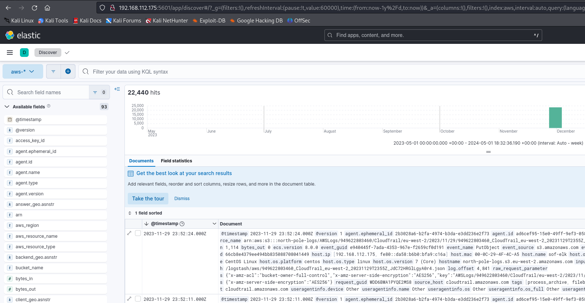
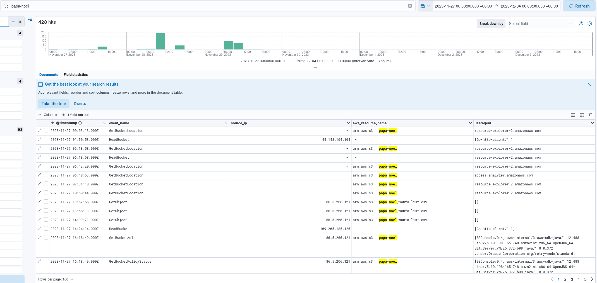
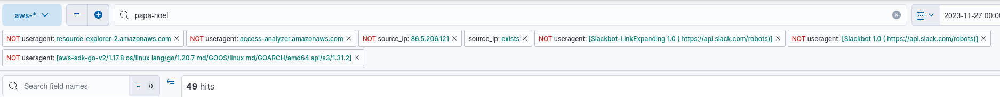
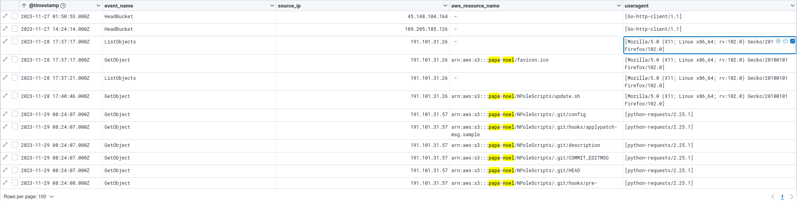
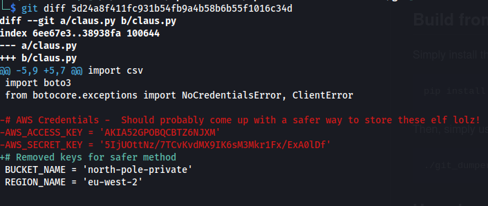

# OpTinselTrace 2

## Speech
```
It seems our precious technology has been leaked to the threat actor. Our head Elf, PixelPepermint, seems to think that there were some hard-coded sensitive URLs within the technology sent. Please audit our Sparky Cloud logs and confirm if anything was stolen! PS - Santa likes his answers in UTC...
```

## Analysis
### Before optinseltrace 2
1. Let's begin with the analysis of the binary exfiltrated in the previous challenge
2. First his md5 --> `62d5c1f1f9020c98f97d8085b9456b05`
3. It's a pretty simple script so we'll do a strings on it and get all we need for the rest of the challenge :
```bash
$ strings santa_deliveries
curl_easy_perform() failed: 
    ========================================
    ||          MERRY CHRISTMAS!          ||
Enter username: 
Enter password: 
elf-admin
3lfP@ssw0rd
Authentication failed. Exiting program.
https://papa-noel.s3.eu-west-3.amazonaws.com/santa-list.csv
christmas_log.txt
Failed to open log file.
Today's Christmas recipient is: 
Name: 
Address: 
Gift: 
Behavior: 
Is the gift delivered? (Y/N): 
Recipient: 
, Response: 
clear
Thank you and Merry Christmas!
```
4. We can see this script is doing some curl, also we get the address of an s3 bucket (https://papa-noel.s3.eu-west-3.amazonaws.com/santa-list.csv) and a username (elf-admin) and a password (3lfP@ssw0rd)
5. It's a good start for analysing our logs

### Optinseltrace 2
1. We have cloudtrails logs, I'm gonna use [sof-elk](https://github.com/philhagen/sof-elk)
2. After the installation is completed I copy the logs to the user folder : `scp -r optinseltrace2-cloudtrail elk_user@192.168.112.175:/home/elk_user/`
3. Then on the elk I laucnhed the script for ingesting the logs, because the script want the input file and the output I wrote a little oneline script for ingesting all logs : `for file in optinseltrace2-cloudtrail/*/*/*/*/*.json; do name=$(basename $file); aws-cloudtrail2sof-elk.py -r $file -w /logstash/aws/$name; done`
4. Then on the kibana interface I have my logs ready to be inspected :)

5. we want to know more about the elf-admin user and more about the s3 bucket papa-noel
6. I begin with a simple filter I put `papa-noel` in the search bar...
    - we get the aws_resource_name = arn:aws:s3:::papa-noel
    - After some look at the raw logs, I made a little table with things that might be interesting:
    
7. Why the user agent ? Be cause we will filter on that, for example we have a lot of `resource-explorer-2.amazonaws.com` which is a thing of aws, probably not our attacker... This one too : `access-analyzer.amazonaws.com` not very interesting, probably not our attacker, we can filter out these fields in order to reduce the number of logs.
8. We have a lot of this IP : `86.5.206.121` and always the same useragent for this IP : `S3Console/0.4`, the most probable explanation is that this IP is legitimate (the one of our client) because it's the most present and alwways using the aws console (access to the aws cloud not only an s3), so let's filter out this IP
9. We also have a lot of logs without IP, I think it's some automatic action... Let's filter out
10. More filter ? Yes ! useragent Slackbot and aws-sdk-go-v2/1.17.8 not interesting
    - I think we are pretty good, I finish with 49 logs
    
    - 4 firefox useragent (might be the attacker)
    - And a lot of python agent, pretty interesting because this agent is doing a lot of GetObject !
    
    - The `Go-http-client` only did `HeadBucket` don't really know what is it but nothing to do with our job...
    - We know the attacker get a lot of file, he begin to recover the file at `08:24:07` (and finish at `08:24:16`)
    - He used the IP `191.101.31.57` for recovering all file through a python script
11. Let's filter only on the IP and filter out the `event_name.keyword` `GetObject` to see what else he did
    - By looking at the different logs we get the user used by the attacker : `"arn": ["arn:aws:iam::949622803460:user/elfadmin"],`
    - We can see he used the `aws-cli` and `aws-sdk`
12. Now we filter on the arn, to get all the logs done by the elfadmin user
    - We have 3 IPs, 86.5.206.121 (we say it's a legitimate IP), 45.133.193.41 (don't know it) and the attacker IP, let's filter on the new one
    - we see that this new IP dl this file : "aws_resource_name.keyword": `["arn:aws:s3:::north-pole-private/bytesparkle.ovpn"],`
    - that must be another IP of the attacker and he took an ovpn file
13. Only one questions is not answered, the number 5...
14. We saw that the attacker get a some git file, we know we have a .git on the s3 bucket, I'll simply download it
    - First I install git-dumper with : `sudo pip install git-dumper`
    - then the download : `git-dumper https://papa-noel.s3.eu-west-3.amazonaws.com/NPoleScripts/.git git`
    - Then I moved in the git folder and launch a git log:
    ```bash
    $ git log
    commit a92e975c8c52221d5c1c371d5595f65eb13f8be5 (HEAD -> master)
    Author: Author Name <bytesparkle@papanoel.co.uk>
    Date:   Tue Nov 28 09:42:16 2023 +0000

        Removed the sparkly creds from the script! How silly of me! Sometimes I'm about as useful as a screen saver on Santa's Sleigh!!!!!!

    commit 5d24a8f411fc931b54fb9a4b58b6b55f1016c34d
    Author: Author Name <bytesparkle@papanoel.co.uk>
    Date:   Tue Nov 28 09:15:34 2023 +0000

        First commit! Happy elf times all around. Christmas is SO close!
    ```
    - I know he has delete some creds in order to find in which file and to recover them in used git diff:
    

### To resume
The attacker had two IP, he used a python script to access a lot of file from the s3 bucket recovered in the binary file given by the traitor, with this script he recovered creds for the aws and he connect in order to download an ovpn file.

## Questions
1. What is the MD5 sum of the binary the Threat Actor found the S3 bucket location in?
    - 62d5c1f1f9020c98f97d8085b9456b05 (cf. analysis > Before optinseltrace 2 > 2)
2. What time did the Threat Actor begin their automated retrieval of the contents of our exposed S3 bucket?
    - 2023-11-29 08:24:07 (cf. analysis > optinseltrace 2 > 10)
3. What time did the Threat Actor complete their automated retrieval of the contents of our exposed S3 bucket?
    - 2023-11-29 08:24:16 (cf. analysis > optinseltrace 2 > 10)
4. Based on the Threat Actor's user agent - what scripting language did the TA likely utilise to retrieve the files?
    - python (cf. analysis > optinseltrace 2 > 10)
5. Which file did the Threat Actor locate some hard coded credentials within?
    - claus.py (cf. analysis > optinseltrace 2 > 14)
6. Please detail all confirmed malicious IP addresses. (Ascending Order)
    - 45.133.193.41, 191.101.31.57 (cf. analysis > optinseltrace 2 > 10 and 12)
7. We are extremely concerned the TA managed to compromise our private S3 bucket, which contains an important VPN file. Please confirm the name of this VPN file and the time it was retrieved by the TA.
    - bytesparkle.ovpn, 2023-11-29 10:16:53 (cf. analysis > optinseltrace 2 > 12)
8. Please confirm the username of the compromised AWS account?
    - elfadmin (cf. analysis > optinseltrace 2 > 11)
9. Based on the analysis completed Santa Claus has asked for some advice. What is the ARN of the S3 Bucket that requires locking down?
    - arn:aws:s3:::papa-noel (cf. analysis > Before optinseltrace 2 > 4)
    - also cf. analysis > optinseltrace 2 > 6