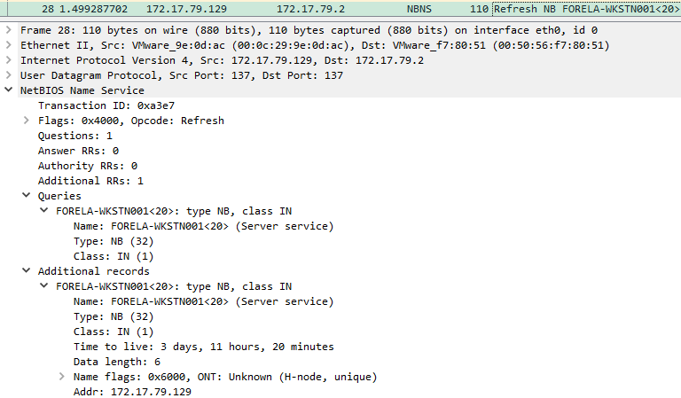

# Reaper

## Speech
```
Our SIEM alerted us to a suspicious logon event which needs to be looked at immediately . The alert details were that the IP Address and the Source Workstation name were a mismatch .You are provided a network capture and event logs from the surrounding time around the incident timeframe. Corelate the given evidence and report back to your SOC Manager.
```

## Analysis

**pcap**
1. Let's take a look at the NBNS (NetBios)
2. We can see the first workstation :

3. Then we have the second workstation :

**evtx**
4. In the evtx we have a weird logon (EventID 4624) at the end, we can see arthur.kyle connecting
5. In the same event we can see the source IP address which is pretty weird (no hostname in pcap/nbns)
6. Just after the logon we have an access to a share, but not much info, we can go back in the pcap
**pcap**
7. filter on smb2 to see the file consulted by the attacker we notice the `\\DC01\Trip` requested but a response `BAD_NETWORK_NAME` response
8. 

## Questions
1. What is the IP Address for Forela-Wkstn001?
    > 172.17.79.129
    - Cf. Analysis > 2
2. What is the IP Address for Forela-Wkstn002?
    > 172.17.79.136
    - Cf. Analysis > 3
3. Which user account's hash was stolen by attacker?
    > arthur kyle
    - Cf. Analysis > 4
4. What is the IP Address of Unknown Device used by the attacker to intercept credentials?
    > 172.17.79.135
    - Cf. Analysis > 5
5. What was the fileshare navigated by the victim user account?
    > \\DC01\Trip
    - Cf. Analysis > 7
6. What is the source port used to logon to target workstation using the compromised account?
    > 40252
    - Cf. Analysis > 5
7. What is the Logon ID for the malicious session?
    > 0x64A799
    - Cf. Analysis > 5
8. The detection was based on the mismatch of hostname and the assigned IP Address.What is the workstation name and the source IP Address from which the malicious logon occur?
    > FORELA-WKSTN002, 172.17.79.135
    - Always same event, we have the answer in the `Network Information`
9. When did the malicious logon happened. Please make sure the timestamp is in UTC?
    > 2024-07-31 04:55:16
    - Same event, system time
10. What is the share Name accessed as part of the authentication process by the malicious tool used by the attacker?
    > \\*\IPC$
    - We see an access just after the event of the logon